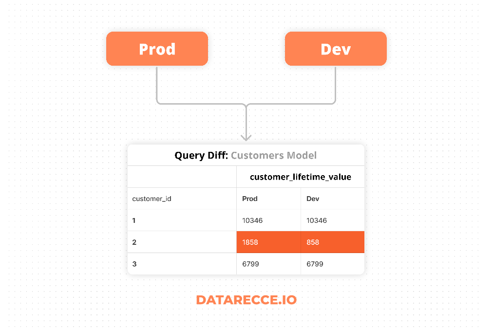
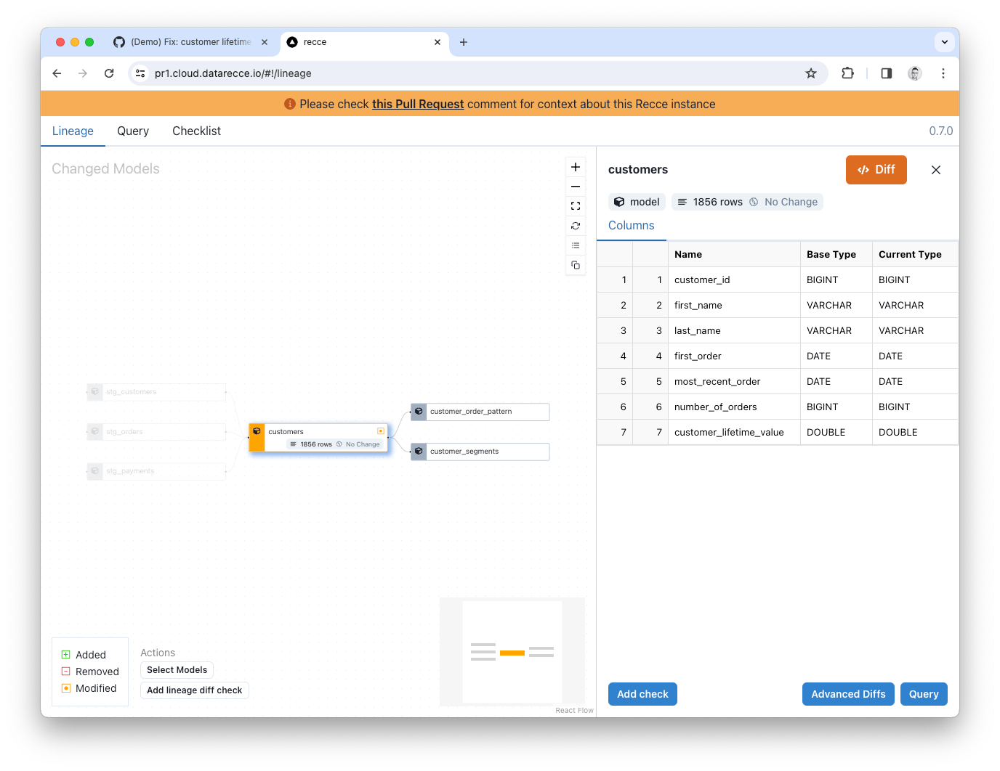
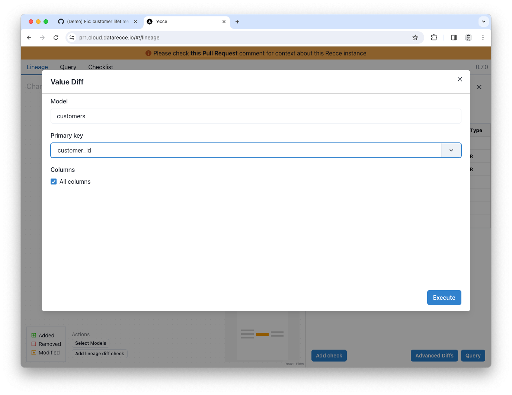

# Hands-On Data Impact Analysis for dbt Data Projects with Recce

dbt data projects [aren’t getting any smaller](https://www.youtube.com/watch?v=lNZLcsHAdco&list=PL0QYlrC86xQnT3HLh-XgvoTf9F3lbsADf&t=934s) and, with the increasing [complexity of DAGs](https://medium.com/inthepipeline/visualize-thousands-of-dbt-models-in-this-3d-dag-viewer-e101871c1577), properly validating your data modeling changes has become a difficult task. The adoption of best practices such as [data project pull request templates](https://medium.com/inthepipeline/use-this-updated-pull-request-comment-template-for-your-dbt-data-projects-de06f12fc38d), and other ‘[pull request guard rails](https://koho.dev/a-data-teams-makeover-how-formalizing-our-analytics-engineering-practice-impacted-our-work-2c0caabc16fe#2a9a)’ has [increased merge times](https://medium.com/inthepipeline/dbt-best-practices-are-in-but-merge-times-are-up-49f72a792680) and prolonged the QA process for pull requests.

<figure markdown="span">
  
  <figcaption>Validate data modeling changes in dbt projects by comparing two environments with Recce</figcaption>
</figure>

The difficulty comes from your responsibility to check not only the model SQL code, but also the data, which is a product of your code. Even when code looks right, silent errors and hard to notice bugs can make their way into the data. **A proper pull request review is not complete with data validation.**

<!-- more -->

## What is data validation and why you need to do it

Validation is the process of checking that your work is correct and achieves your intention. Common forms of validation are **data change impact analysis** and **regression testing**. 

With **impact analysis** checks you want to verify that any impact observed is desirable, such as a change in business logic for which you would expect to see data change. **Regression testing**, on the other hand, is about confirming that data change did not take place. This is useful for cases in which any change to modeling code should *not* impact the data.

For both of these cases comparing the resultant data from your dev branch with a known-good baseline is the key - **Show me what’s different, or help me validate that nothing changed**. This is where [Recce](https://datarecce.io/) can help.

## Data Validation Toolkit: Recce

[Recce](https://datarecce.io/) is a toolkit especially designed to validate data modeling changes in dbt projects by comparing two dbt environments, such as your dev branch and production data. Recce can help you validate your changes during development, and then use those validations in your PR comment for better PR review - the ultimate purpose of modeling validation.

## Use Case: Data Impact Analysis in dbt’s Jaffle Shop

Jaffle Shop is dbt’s standard intro project for dbt, so hopefully everyone is familiar with it. For this use-case demo, I’ll show how to go from a modeling code change in Jaffle Shop and validate that change using the check suite diffing of tools in Recce.  

Follow along with the drill down steps detailed below by using the online Recce demo, and the actual PR:

- **Online Recce Demo:** https://pr1.cloud.datarecce.io/
- **PR:** [Fix: customer lifetime value calculation in customers](https://github.com/DataRecce/jaffle_shop_duckdb/pull/1)

### The code change

The code change for this example is simple. It’s a [one-liner in the Customers model](https://github.com/DataRecce/jaffle_shop_duckdb/pull/1/files#diff-621fb4dc918b770bb6c9389467cc3f6c560d947bd78c6b6926aebda8a0d47125) that modifies the calculation used for `customer_lifetime_value` to only include completed orders.

<figure markdown="span">
  
  <figcaption>Business logic change to the customers model</figcaption>
</figure>

### The expected impact

This is a **change to business logic (maybe more a bug fix)**, so we would **expect to see data impact**. As the engineer working on the PR, you’ll already have an expectation of the type of impact you should see. 

Previously, the calculation for `custom_lifetime_value` included *all* orders, regardless of status, meaning `returned`, and `return_pending` were erroneously included. After adjusting the calculation we would expect to see:

- An overall reduction in the `customer_lifetime_value` figures in this table.
- Impact to downstream tables that use this figure

We don’t know the scale of the impact, yet. Let’s first validate our expectations and then check the impact.

## Data drill-down process

For a small change such as this, you might go straight to some smaller data spot-checks, but in larger projects, or with more complex updates, it’s better to follow a process of ‘drilling down’ into the data from high level checks, and then narrowing the focus to spot-checks. This will give you the full overview of impact to model and then give you the clues about what to check next.

## Impact Overview

Lineage DAG Diff shows how the DAG has changed based on your branch code and shows added, removed, and modified models.

<figure markdown="span">
  
  <figcaption>Lineage Diff in Recce with Row Count and Schema Diff</figcaption>
</figure>

In the Lineage Diff for this example, you can see that only the `customers` model has been modified. 

Clicking the model pulls up the schema and you can check the row count. If there were schema changes they would be shown here (added, removed, and renamed columns). We don’t see any indication of change to the schema, the row count shows no change, and the only modified model is the `customers` model, so you have validated that there is no undesired change to the high level structure of the project.

***Note:** Lineage Diff differs (ha!) from the regular dbt lineage DAG because it shows the state of the DAG compared to another state. Whereas the dbt docs lineage DAG shows only the current state.*

## High-level data impact assessment

The next stage of validation is high-level assessment. There are a number of checks that you can employ for this, currently [Profile Diff](https://datarecce.io/docs/features/profile-diff/), [Value-Diff](https://datarecce.io/docs/features/value-diff/), and Top-K Diff. Each providing a different statistical comparison to your baseline data.

### Profile Diff

With the `Customers` model still selected, click the `Advanced Diffs` button and click `Profile Diff`.

<figure markdown="span">
  
  <figcaption>Data Profile Diff in Recce</figcaption>
</figure>

The Profile Diff shows lots of stats for each column but, for this modeling change, check the min, max, and avg. You can see that the average value for the `customer_lifetime_value` column has dropped, which confirms our expectation, because a lot of orders have been excluded from the calculation now.

### Value Diff

A Value Diff is also a good way to get a high level overview of change to a model. With the `Customers` model selected in the Lineage, click `Value Diff` from the Advanced Diffs. Select `customer_id` as the primary key, and check the `All Columns` checkbox, then click the Execute button.

<figure markdown="span">
  
  <figcaption>Choose the primary key and which columns to diff</figcaption>
</figure>

The Value Diff shows the percentage match for each column:

<figure markdown="span">
  
  <figcaption>Value Diff results in Recce</figcaption>
</figure>

All columns are 100% match, except the `customer_lifetime_value` column, which now shows only 1.19% match (2 rows) - **That’s quite a lot of impact, you better spot-check some of the data! ;-)**

## Fine-grained data spot-checks

[Query Diff](https://benn.substack.com/p/all-i-want-is-to-know-whats-different) enables you to run a query against both environments, and diff the difference. It’s the best way to spot-check data and [see what’s different](https://benn.substack.com/p/all-i-want-is-to-know-whats-different). You can use any macros that are installed in your dbt project, and in a lot of ways this is like creating an ephemeral model especially for the purpose of data validation. In the simplest form, we can just select a subset of rows and see where the change is.

With the `Customers` model still selected in the Lineage Diff, click the Query button at the bottom right and then adjust the query to select a subset of data:

```
select * from {{ ref("customers") }} where customer_id < 100;
```

***Note:** Avoid using LIMIT in Query Diff because LIMIT does not return the same rows each time, which is required form a useful query diff.* 

Click `Run Diff` to query both dbt environments.

When the results are returned **click on the key icon in the customer_id column to confirm the primary key.**  Any columns with a mismatched value will be displayed in red.

<figure markdown="span">
  
  <figcaption>Query Diff results in Recce</figcaption>
</figure>

Spot-checking the `customer_lifetime_value` column you can see that the current value (the dev branch) are all decreased. This is correct as the calculation we adjusted should only result in a decrease in total order value.

Also, from the Value Diff we ran earlier, we know that *only* the `customer_lifetime_value` column should have changed, and that’s confirmed from this Query Diff. 

## Checking downstream impact

This code change updates a key model, and the `customer_lifetime_value` column is used downstream in the `customer_segments` table. With the impact being so great (~99% of customer_lifetime_value has changed) we should check how this affects downstream models.


<figure markdown="span">
  
  <figcaption>The customer_segments model uses customer_lifetime_value</figcaption>
</figure>

Running a Top-K Diff on the `value_segment` column of `customer_segments` shows how the distribution has changed with a notable reduction in customers categorized as ‘High value’.

<figure markdown="span">
  
  <figcaption>Top-K Diff on customer_segments.value_segment</figcaption>
</figure>

Given the change in distribution, if this was a real world situation, you might choose to notify downstream stakeholders. 

## The Checklist

The process above demonstrates how you would validate your work during development but, as mentioned, the ultimate purpose of data validation is to provide proof-of-correctness of your work for PR review. 

At each stage in the validation process Recce allows you to add a validation check to the checklist, along with your notes. Just click the `Add to Checklist` or `Add Check` button when you see it, and the current validation check will be added to your checklist.

<figure markdown="span">
  
  <figcaption>Validation checklist in Recce</figcaption>
</figure>

In the checklist you can add a note for your validation to explain your findings and provide context. Then, when you’re ready to create a PR, you can copy the checklist items into your PR to help the reviewer understand and sign-off on your work. 

## Conclusion

In the above steps, you performed a data impact analysis and successfully validated the code changes by inspecting the data at varying grains of detail.

Check back for more articles in the future that look at other use cases such as validating a refactoring job, and also how to make the most of Recce validations in your PR comment.

### Get started with Recce

Recce OSS is available on [GitHub](https://github.com/datarecce/recce) now. Follow the instructions in our [Getting Started](https://github.com/datarecce/recce) guide to start using Recce to validate your data modeling changes in your project.

- **GitHub**: [DataRecce/Recce](https://github.com/datarecce/recce)
- **Docs**: [DataRecce.io/docs](https://datarecce.io/docs)
- **Discord**: [Recce Community](https://discord.gg/bP2Yfk9KEA)

<script src="https://gist.github.com/DaveFlynn/4135bc92aea95227939e3db03cf479a5.js"></script>


