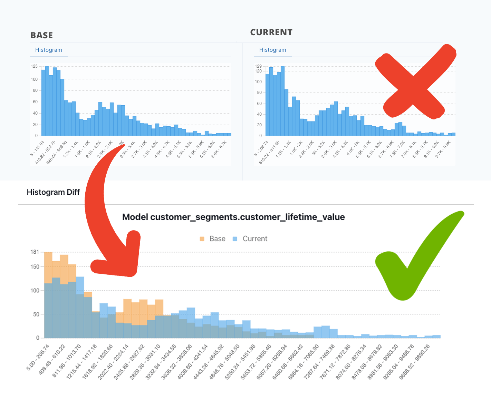
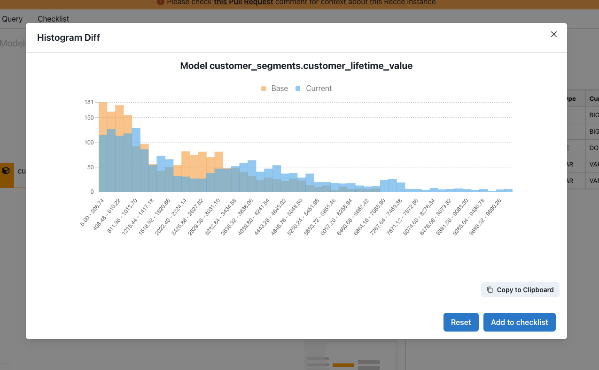
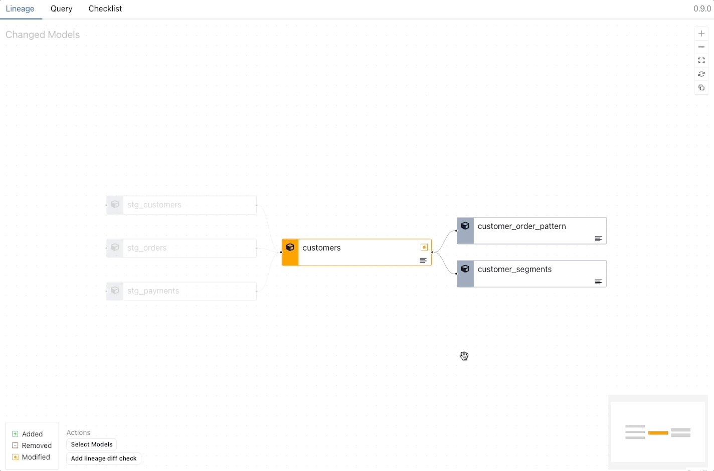

# Use Histogram Overlay and Top-K Charts to Understand Data Change in dbt

Data profiling stats are a really efficient way to get an understanding of the distribution of data in a dbt model. You can immediately see skewed data and spot data outliers, something which is difficult to do be checking data at the row level.

## Visualize data change with histogram and top-k charts

**Profiling stats become even more useful when applied to data change validation.** Let’s say you’ve updated a data model in dbt and changed the calculation logic for a column — how can you get an overview of how the data was changed or impacted? This is where checking the top-k values, or the histogram, of before-and-after you made the changes, comes in handy — **But there’s one major issue...**

<figure markdown="span">
  
  <figcaption>The best way to visualize data change in a histogram chart</figcaption>
</figure>

## Something’s not right

If you generate a histogram graph from prod data, then do the same for your dev branch, you’ve got two distinct graphs. The axes don’t match, and it’s difficult to compare:

<!-- more -->

<figure markdown="span">
  
  <figcaption>Comparing to distinct histogram charts is impossible</figcaption>
</figure>

You might be able to spot some differences, such as at the top end of the graph, but the **overall impact is mostly hidden**.

The same is true for top-k. Cross-referencing categories might be doable when there are only a handful, but it’s still not a meaningful way to visualize the differences:

<figure markdown="span">
  
  <figcaption>Cross-referencing Top-K will become difficult with more categories</figcaption>
</figure>

There’s a real possibility that you’ll miss some edge cases when you can’t compare precisely and accurately. That means silent errors, or even pipeline-breaking errors, will make it into prod. Errors that you won’t find out about until the client or stakeholder calls to asks what’s up with the data.

## How to meaningfully compare histograms and top-k

**The best way to diff profile stats like histogram and top-k stats, is to plot them on a single chart, overlaid on top of each other using shared axes.**

Here’s the same histogram charts as the image above, but with the histograms plotted on a single chart:

<figure markdown="span">
  
  <figcaption>An overlaid histogram makes the charts actually useful!</figcaption>
</figure>

In this overlay histogram chart, you can quickly see the distribution change in a meaningful way. At each value range the scale of the data change is clear. The same is true for top-k. When the values are compared directly next to each other the impact is immediately understandable.

<figure markdown="span">
  
  <figcaption>Side-by-side Top-K values for direct comparison</figcaption>
</figure>

Doing this manually isn’t straight forward. You’d need to code it in a Jupyter notebook with python and would take a lot of configuration, especially given that for dbt data projects you’ll be pulling data from two different schemas if you’re diffing dev and prod. Checking this kind of data profile diff for each PR in your project would require an unreasonable amount of work.

## Easily diff histogram, top-k and other profiling stats in Recce

You can get histogram and top-k diffs, especially designed for dbt data projects, as part of the suite of data modeling validation tools in Recce.

Recce compares your development and production datasets (or any two dbt envs) and enables a visual representation of data change through multiple diffing tools and query comparisons.

<figure markdown="span">
  
  <figcaption>Get an overlaid histogram diff for your dbt PR Review with Recce</figcaption>
</figure>

## Improved visibility of data change for dbt

As a data or analytics engineer, the improved visibility of data change makes validating your work quicker, easier, and more accurate.

As a PR reviewer you can do your job more efficiently and confidently sign off on data changes knowing that an edge case won’t come back to bite you.

Recce is open-source and available now, so you can start properly validating your dev branch right away.

## Get Recce

- [GitHub](https://github.com/datarecce/recce)
- [Recce Docs](../../docs/index.md)
- dbt Slack Channel [#tools-Recce](https://getdbt.slack.com/archives/C05C28V7CPP)

