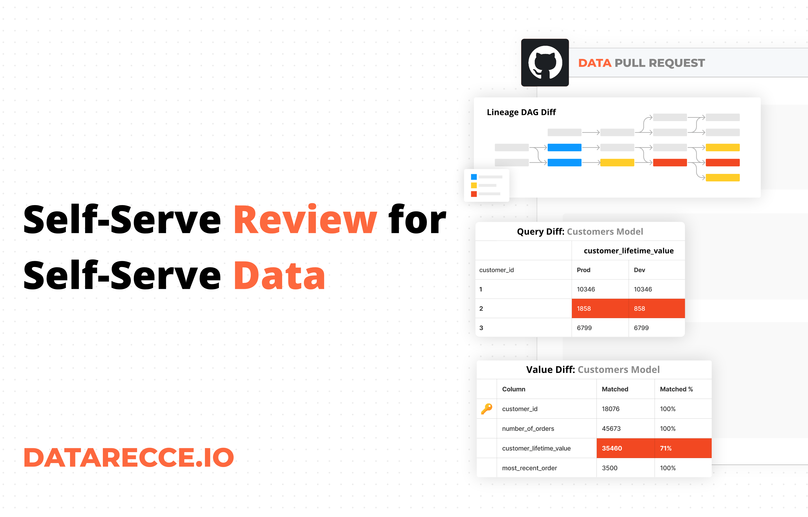

# Self-Serve Review for Self-Serve Data

dbt has been revolutionary for data teams. ELT in general has changed the way we create and maintain data pipelines, but the biggest change has come in the form of ‘self-serve data’.

> A self-serve data platform… supports creating new data products without the need for custom tooling or specialized knowledge. — [dbt](https://www.getdbt.com/blog/key-components-of-data-mesh-self-serve-data-platform#what-is-a-self-serve-data-platform)

The concept of **self-serve** data opened up access to the wider data team — You’ve probably found that all data roles in your team, from data engineer to data analyst, can have a hand in modifying and managing data, which brings new challenges to maintaining data stability.

<figure markdown="span">
  
  <figcaption>Bring Self-Service Review to Self-Service Data</figcaption>
</figure>

## Data Incidents still happen

Even with all of the benefits that dbt brings **bad merges still happen**. Your code is version controlled, and you can track and review code changes easier than ever, but data projects bring a unique challenge — you need to **review the code and the data**.
<!-- more -->

## Context matters

In your team, you might find that **data engineers are closer to infrastructure**, while **analysts are closer to business context**. This means when it comes to pull request (PR) review on a data project:

- **data engineers** are better able to review PRs in terms of structural impact and integrity,
- while **analysts** are better able to review PRs in terms of business context, but might be less aware of the larger impact to the data pipeline.

*The line between these roles is blurring since the introduction of the ‘analytics engineer’, but that transition is relatively new.*

## Self-serve review for self-serve data

The situation we end up with is that analysts are pushing changes to data projects without performing a complete PR review. This results in engineers fire-fighting issues post-merge, without proper context.

### Enable analysts to review their own work

The solution is a way for analysts to perform self-serve review to validate their work, while at the same time providing context to peer reviewers responsible for merging changes into production.

**How can you help analysts to perform better PR reviews?**

There are processes you can put in place, like enforcing the use of pull request comments templates that help PR authors to structure their PRs, but the main issue comes down to how to perform impact assessment. Which, in turn, boils down to — how did this PR change the data?

If you can provide analysts with the tools they need to check their work, you can eliminate bad merges.

## All I want to know is what’s different

I previously mentioned that the main difficulty comes from assessing the impact of code changes on data. For analysts to QA their data modeling work, the best way to understand data impact, is to see how the data changed.

As Benn Stancil, of Mode Analytics, [puts it](https://benn.substack.com/p/all-i-want-is-to-know-whats-different): *“All I want is to know what’s different”. Benn says that “figuring out if a business metric is accurate”, after making data modeling changes, consists of simply checking “if historical values of the metric are the same today as they were yesterday”*.

How do you know if something has been impacted? Check what it used to look like!

## The right tool for the job

There are tools out there like dbt_audit_helper and dbt_profiler that can be configured to compare two states of data, but it’s a lot of hoops to jump through, especially if you want to configure them for each PR.

A better option would be to use a toolkit like Recce, that abstracts the functionality of these tools into a user-friendly interface for checking dev data against prod (or staging as you’ll see below).

Recce gives you a data checking environment and a suite of comparison tools especially designed for inspecting and assessing data change between two dbt environments. With the data checks you perform you can create better PR comments and add context to PR reviews

## dbt best practices for data impact analysis

Regardless of which tools you use to compare data states, there are some best practices that you should be aware of

- Make full use of schemas to test transformations before merging to prod
- Use a staging environment as a base for comparison (as opposed to comparing directly to prod)
- Limit the data range in staging and development environments to reduce costs

For full details check out [best practices documentation](../../docs/guides/best-practices-prep-env.md) for preparing dbt environments for testing.

## Get Recce

- [GitHub](https://github.com/datarecce/recce)
- [Recce Docs](../../docs/index.md)
- dbt Slack Channel [#tools-Recce](https://getdbt.slack.com/archives/C05C28V7CPP)

