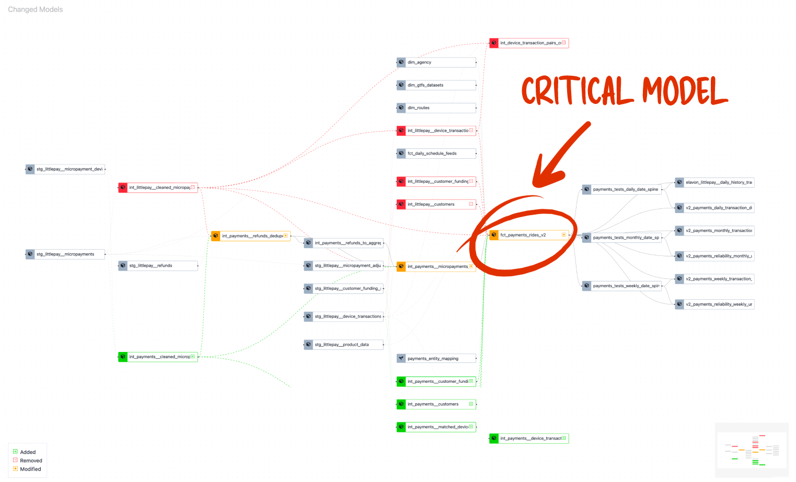
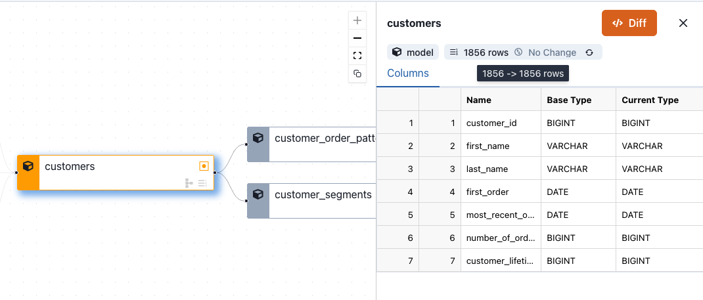
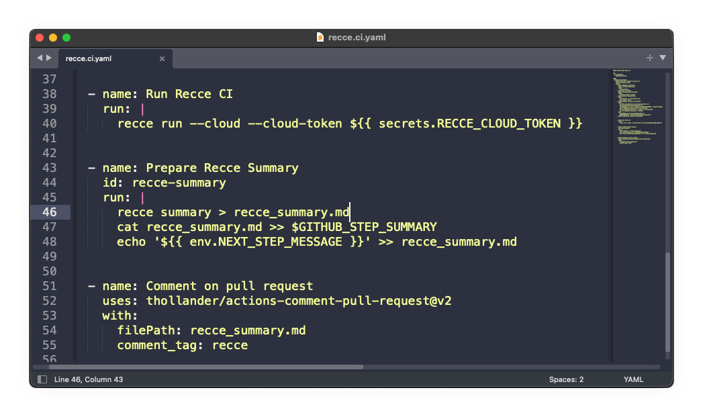

# Identify and Automate Data Checks on Critical dbt Models

**Do you know which are the critical models in your data project?**

I’m sure the answer is yes. Even if you don’t rank models, you can definitely point to which models you should tread carefully around.

**Do you check these critical models for data impact with every pull request?**

Maybe some, but it’s probably on a more ad-hoc basis. If they really are critical models, you need to be aware of unintended impact. The last thing you want to do is mistakenly change historical metrics, or lose data.

<figure markdown="span">
  
  <figcaption>Impacted Lineage DAG from Recce showing modified and impacted models on the California Integrated Travel Project dbt project</figcaption>
</figure>

## Identifying critical models

Knowing the critical models in your project comes from your domain knowledge. You know these models have:

<!-- more -->

- a particular significance to business,
- a ton of downstream models,
- or, from experience, you’ll get a call about that data if something goes wrong

If you check these models in an ad-hoc way, it might be time to apply a more formal ranking system to models, which will also help the triage process if something does go wrong.

## When to check critical models

Checking that these critical models didn’t change is really important, and you need to do this before merging your updated models into prod. You might have a data observability tool in place to monitor prod data but, if you merge a breaking change, it’s already too late. The downstream damage is already done.

You can check the data in two ways before merging:

- During development: This is when you’re making SQL changes, and editing models and metrics, checking the data and proactively and looking for data impact.
- Automatically in CI: These checks run automatically in continuous integration (CI). You still need to review the checks, but they are run automatically for each pull request (PR) on your data project.

This mix of manual and automated checks gives you a good chance at comprehensive coverage, but you still need the domain knowledge to identify those critical models.

## A plan for checking critical models

Checking the data in critical models involves comparing the data generated from your development branch with production (or staging data). The process looks like:

- **Identify critical models** — Models which are bottlenecks or are important to business
- **Decide which checks to run** on these models — Data should not change in these models so you should run structural and data profiling checks
- **Automate** the checks — Run the checks in CI with each PR
- **Review** check results — As part of PR review check if there is impact, and if it’s is intended or not

## Automating Critical Model Checks

Critical models checks should run with each PR, here’s how you can do that with the preset-checks feature in Recce, by committing a checklist to your data project repo.

Let’s say you want to have the following structural checks run with each PR for your customers model:

- Row count — You shouldn’t lose any data.
- Schema — The schema should not change unexpectedly.

These are fundamental checks that all critical models should have, regardless of the type of PR.

<figure markdown="span">
  
  <figcaption>Schema and row count checks performed in Data Recce</figcaption>
</figure>

You can run these checks in the Recce UI, and any of these checks can also be automated in CI. Here’s how:

### 1. Generate your check file (recce.yml) and commit to your project

To add the row count and schema checks to your dbt CI job you just need to commit a Recce checklist (`recce.yml`) to your dbt project. From the Recce UI you would:

1. Add the check to your checklist.
2. Copy the preset check template to your `recce.yml`

<figure markdown="span">
  
  <figcaption>Recce.yml in the dbt project root</figcaption>
</figure>

Then commit the `recce.yml` in the root of your dbt data project. Each branch will get a copy of these checks, and Recce will run the checks each time a PR is opened.

### 2. Run Recce in CI

When Recce runs in CI, the checks in `recce.yml` will be automatically run. Recce also provides a command to generate a PR summary with your results, which can also be automatically added to the PR comments for reviewers to check

<figure markdown="span">
  
  <figcaption>Run Recce in CI</figcaption>
</figure>

### 3. Review the results

The Recce summary, posted to your PR comments, shows you the following things:

- A diagram of the impacted lineage — this is just the part of the lineage that has modifications, or is downstream of modified models
- A list of checks that detected a **data mismatch**

<figure markdown="span">
  
  <figcaption>Review Recce CI Summary</figcaption>
</figure>

If there was a difference in the row count, or the schema changed, on the customers model, then those checks will be listed here.

The idea behind the Recce Summary is ‘**all signal, no noise**’, which means you only want actionable or useful information — **You only want to know when there’s a difference**, if everything is the same there’s no point telling you that, it’s just noise that would crowd out the signal.

### 4. (optional) Data impact exploration

If one of the checks indicated a data-mismatch, or you’ve otherwise seen something that you want to inspect, you can download the Recce state file and run Recce in review mode to see the results of the checks.

<figure markdown="span">
  
  <figcaption>Download the Recce state file and execute Recce in Review Mode</figcaption>
</figure>

To perform live checks on the data, you need only add a `dbt_project.yml` and `profiles.yml`, there’s no need to checkout the whole dbt project. Then you can perform live checks to compare dev with prod/staging.

## Conclusion

Every data project will have those critical models. It’s fine to check them ad-hoc while you are working on the data project and validating the data generated from your changes. But it’s best practice to identify and automate checks on these critical models.

- Identify your critical models
- Curate a checklist for things you know should not change in these models (project specific)
- Run this checklist in your PRs with Recce
- Review impact if necessary

## Get Recce

- [GitHub](https://github.com/datarecce/recce)
- [Recce Docs](../../docs/index.md)
- dbt Slack Channel [#tools-Recce](https://getdbt.slack.com/archives/C05C28V7CPP)

