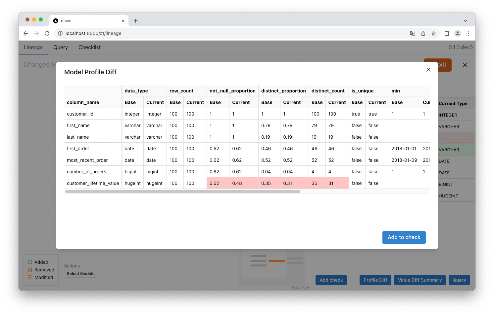
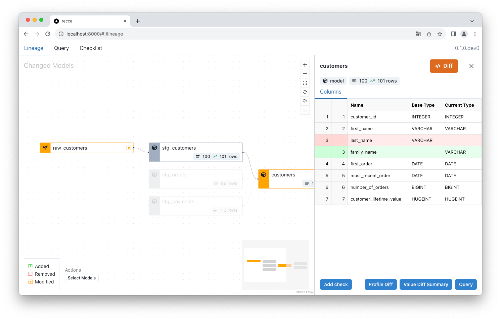
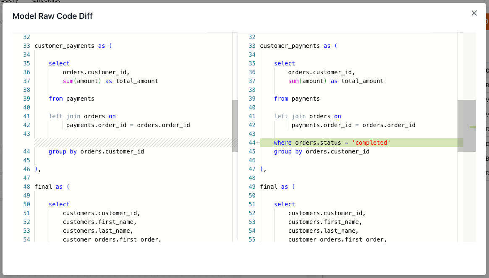

# Next-Level Data Validation Toolkit for dbt Data Projects — Introducing Recce

<figure markdown="span">
  
  <figcaption>Recce: Data Validation Toolkit for dbt</figcaption>
</figure>

Validating data modeling changes and reviewing pull requests for dbt projects can be a challenging task. The difficulty of performing a proper ‘code review’ for data projects, due to both the code and data needing review, means the data validation stage is often omitted, poorly implemented, or [drastically slows down time-to-merge](https://medium.com/inthepipeline/use-this-updated-pull-request-comment-template-for-your-dbt-data-projects-de06f12fc38d) for your time sensitive data updates.

How can you maintain data best practices, but speed up the validation and review process?

<!-- more -->

## Recce — The data validation toolkit for dbt projects

Recce (short for reconnaissance) is a data modeling validation toolkit with a focus on environment diffing. Take two dbt environments, such as dev and prod, and compare them using the suite of diff tools in Recce.

## Your Diffing Toolkit

With Recce you’re able to validate your data modeling changes against a known-good baseline. The only real way to verify modeling changes is to check it against historical/production data.

### Lineage DAG Diff

Start from the zone of impact of your changes, and see which models have been modified, added, and removed. The dbt docs lineage DAG only shows you the current state of the DAG, Recce shows you how the DAG differs from before you made any changes.

<figure markdown="span">
  
  <figcaption>Lineage DAG Diff in Recce</figcaption>
</figure>

### Data Profile Diff & Value Diff

Perform holistic checks by diffing the data profile stats for your development branch, then check the percentage of values matching for each column in a model.

<figure markdown="span">
  
  <figcaption>Data Profile in Recce</figcaption>
</figure>

### Query Diff

If something needs further investigation, drill down and query the data. One query will run on both environments, and you’ll be able to see the difference on a row-by-row basis. Enable change-only view to see just what’s changed.

<figure markdown="span">
  
  <figcaption>SQL Query Diff in Recce</figcaption>
</figure>

### Schema and Row Count

In addition to the above diffs, you can also check the schema and row count, just to be sure you didn’t lose any data, or an important column.

<figure markdown="span">
  
  <figcaption>Schema and Row Count in Recce</figcaption>
</figure>

### Create your checklist

As you create validations, add them to your checklist with notes about what you found, and re-re-run checks if the data changes. When you’re ready, export the checks to your PR comment.

<figure markdown="span">
  
  <figcaption>Data Project PR Checklist in Recce</figcaption>
</figure>

### Create your <em>all signal, no noise</em> PR comment

When you’re ready to share your validations as proof-of-correctness for your work, you can export checks into your [PR comment template](https://medium.com/inthepipeline/use-this-updated-pull-request-comment-template-for-your-dbt-data-projects-de06f12fc38d). You can copy your notes, and export a screenshot of the check as it appears in Recce. By curating the validations for your PR comment, you can create an ‘all-signal, no noise’ comment with the validations that are relevant to the context of your changes.

<figure markdown="span">
  
  <figcaption>Data Modeling Validations in PR Comment</figcaption>
</figure>

The reviewer will be able to see the query and results of your data spot-checks and have the comprehensive information required to request further investigation, or sign-off on your changes.

## Why Recce?

As mentioned above, whether you’re the pull request author, or reviewer, you’ve got the difficult task of understanding what is going on and trying to verify if the intentions of the PR were realized without screwing up production data. Here’s some common issues we’ve heard about working on large, or business critical, dbt data projects:

- QA for pull requests takes too long — stakeholders want to merge new data features faster.
- dbt build worked, but the data was actually wrong.
- I’m sick of downtime from silent errors making it into prod.
- CI takes too long and current data quality tools are costly to run.
- I just want to see a summary of what changed for modified models.

If any of these pain points ring true, Recce can help with the code review on your data project.
Open-source and available now

Recce OSS is available on GitHub now. Follow the instructions in our Getting Started guide to start using Recce to validate your data modeling changes.

- GitHub: [DataRecce/Recce](https://github.com/datarecce/recce)
- Docs: [DataRecce.io/docs](https://datarecce.io/docs)
- Discord: [Recce Community](https://discord.gg/bP2Yfk9KEA)

## Try Recce Online

If you want to try Recce out without having to install, check out the demo instance below.

### Demo

The [demo PR](https://github.com/DataRecce/jaffle_shop_duckdb/pull/1) makes a simple change to the dbt’s Jaffle Shop project and changes how customer_lifetime_value (CLV) is calculated (fixes it to only calculated completed orders).

<figure markdown="span">
  
  <figcaption>Can you validate this code change using Recce?</figcaption>
</figure>

The expectation from this change is that CLV will be reduced overall, and that this will also impact the customer segments downstream model, With that in mind, see if you can determine if the if the PR has any issues by checking the data in Recce:

- <strong>The PR:</strong> [https://github.com/DataRecce/jaffle_shop_duckdb/pull/1](https://github.com/DataRecce/jaffle_shop_duckdb/pull/1)
- <strong>Recce Demo instance:</strong> [https://pr1.cloud.datarecce.io/](https://pr1.cloud.datarecce.io/)

<em>Hint: Run a Profile Diff, then a Query Diff, on the customers model, then check for downstream impact.</em>

