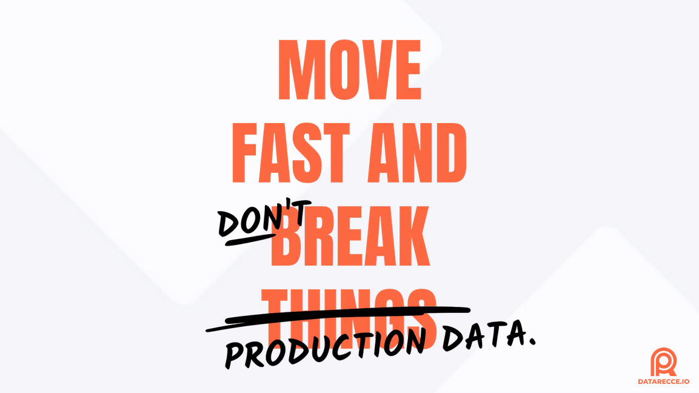
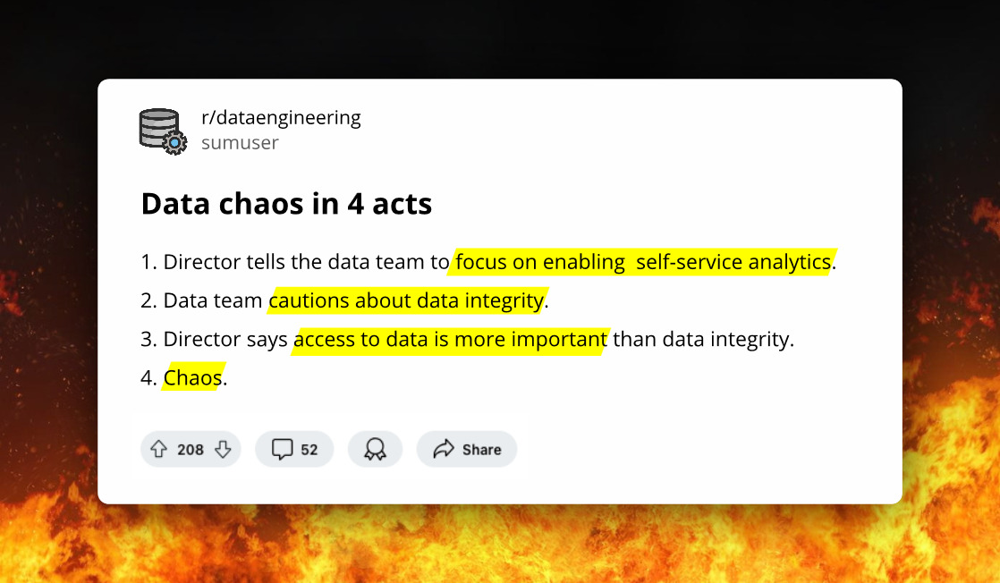
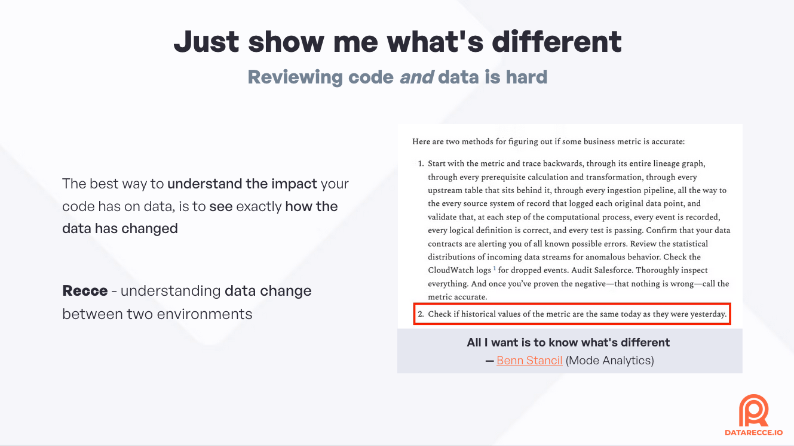

# The Guide to Supporting Self-Serve Data and Analytics with Comprehensive PR Review

dbt, the platform that popularized ELT, has revolutionized the way data teams create and maintain data pipelines. The key is in the ‘T’, of ELT. Rather than transforming data before it hits the data warehouse, as in traditional E*T*L, dbt flips this and promotes loading raw data into your data warehouse and transforming it there, thus EL*T*.

This, along with bringing analytics *inside* the data project, makes dbt an interesting solution for data teams looking to maintain a single-source-of-truth(SSoT) for their data.

<figure markdown="span">
  
  <figcaption>Move Fast and DON'T Break Prod</figcaption>
</figure>

<!-- more -->

**dbt transformations are stored as a series of SQL models** that transform the data through raw, staging, intermediate, and then mart stages, in which the data is ready for production use. Keeping all if these these transformations in the same place, as **the** **SSoT for how your data is generated**, has huge benefits, such as:

- **Version control** - the dbt project can be managed in a version control system such as git.
- **Modular SQL** - dbt encourages a modular design to data pipelines, enabling data models to be referenced by multiple downstream models and adhering to don’t-repeat-yourself (DRY) principles.
- **Reproducible pipelines** - the dbt project contains everything required to run the pipeline, which means anyone can checkout the project from version control and build the data.

If you’ve come from a software engineering (SE) background, then these benefits may be familiar to you. Version control, modularity, and reproducibility are **the tenets of DevOps**, and have benefited software development for years. Through dbt, you’re able to adapt them as part of a new practice of **DataOps,** and **the pull request (PR) is at the center of the process.**

## Data Incidents still happen

Given the benefits that dbt brings, you’d be forgiven for thinking that the data problem was solved - That data was always accurate, and bad data was never merged into production. Unfortunately, due to the relative infancy of DataOps, that’s still not the case. Data incidents still happen.

As CL Kao, founder of [Data Recce](https://datarecce.io/) put it in a recent [fireside chat](https://datarecce.io/firesidechat/) with Noel Gomez of [Datacoves](https://datacoves.com/):

> <i>“The construct that turned devops from a best practice into a viable, productionized, practice, is the pull request… preview, decide, deploy. (However) **In data, we deploy, and then decide if we want to fix it later**”</i> - **CL Kao**, [Data Productivity - Beyond DevOps and dbt](https://datarecce.io/firesidechat/)
> 

The “deploy and then fix it later” quote probably rings true for a lot of data teams that are working under tight deadlines, with many simultaneous PRs, and find it difficult to perform due diligence on every PR before merging.

### Look ma, no guardrails!

The version controlled nature of dbt means that the **code is easily reviewed, but what about the data?** This is the unique challenge presented to data teams - how to best **make use of the pull request stage to add guardrails to the PR review process to avoid merging bad data into production**. It’s incredibly important, because the impact of bad data on business can be costly. 

### How much does a data incident cost?

Merging bad data, whether that be from accidentally changing historic data, to introducing silent errors into production data, can be very costly.

<figure markdown="span">
  
  <figcaption>The Cost of Data Incidents</figcaption>
</figure>

Mikkel Dengsoe of Sync recently [calculated](https://medium.com/@mikldd/the-cost-of-data-incidents-53646b588601) that if the cost of a data incident ranges from $1,000 to $100,000 per-incident, that for a large data team that could result in costs of *“between $500,000 and $4,000,000 per year”*.

As Mikkel puts it, the value of data for business critical applications is high:

> *“A few hours of incorrect data for an eCommerce ad bidding machine learning model can easily cost $100,000.”*  Mikkel Dengsoe, [The cost of data incidents](https://medium.com/@mikldd/the-cost-of-data-incidents-53646b588601)
>

## The reason dbt data PRs are hard to review

Firstly, data change is inherently hard to review. You’re adapting the pull request review process from software practices, but it’s not ideally suited to reviewing data. PR review is all about reviewing code, not data.  When you open a pull request on a data project, **you can easily see how the SQL code** and transformation logic **has changed, but the data is still a black box**. 

<figure markdown="span">
  
  <figcaption>New Challenges to Data Integrity</figcaption>
</figure>

Secondly, **dbt has introduced the new concept of ‘self-serve data’.** A practice which completely changes how organizations think about data **by opening up data access to more people in the organization**. This shift, and the potential issues it might cause, require a rethinking of the role of data teams in the organization and, of course, which tools to use to support these new practices.

  

  

        <link href="//cdn-images.mailchimp.com/embedcode/classic-061523.css" rel="stylesheet" type="text/css">
    
  

    <h2 style="text-align: center; color: #ff6e42; font-size: 1.2rem; margin-top: 0">Download the Deck</h2>

  <form action="https://datarecce.us1.list-manage.com/subscribe/post?u=2b18366427f11835f05f68aeb&amp;id=b82bfd845e&amp;f_id=00bd81e5f0" method="post" id="mc-embedded-subscribe-form" name="mc-embedded-subscribe-form" class="validate" target="_blank">
          

              
* indicates required

              
<label for="mce-EMAIL" style="color: #000;">Enter your email address and we'll send you the presentation deck: *</label><input type="email" name="EMAIL" class="required email" id="mce-EMAIL" required="" value="" style="background-color: #fff; color: #000; font-size: 0.9rem">

  
<input type="hidden" name="tags" value="6327490">

          

              

              

          

<input type="text" name="b_2b18366427f11835f05f68aeb_b82bfd845e" tabindex="-1" value="">

<input type="submit" name="subscribe" id="mc-embedded-subscribe" class="button" value="Send me the PDF" style="background-color: #ff6e42; text-transform: uppercase; font-weight: bold; font-size: 0.9rem; padding: 0.3rem 1rem; height: auto;">

      

  </form>
  

  

## What is self-serve data?

The core principle of self-serve data is to enable wider access to data without the need for specialized knowledge, or the help of data specialists. As [atlan](https://atlan.com/what-is/self-service-data/#what-is-self-service-data-what-are-its-key-characteristics) says, users should be able to “**access, analyze, and manipulate the data”** by themselves:

> Self-serve data refers to **tools… that enable …users** **to** access, analyze, and **manipulate data** **without** requiring the direct intervention of **data specialists**
— [atlan](https://atlan.com/what-is/self-service-data/#what-is-self-service-data-what-are-its-key-characteristics)
> 

[dbt](https://www.getdbt.com/blog/key-components-of-data-mesh-self-serve-data-platform#what-is-a-self-serve-data-platform) takes it a step further, in that **users should not require specialized knowledge** to create new data products:

> A self-serve data platform… supports **creating new data products** **without** the need for custom tooling or **specialized knowledge**.
— [dbt](https://www.getdbt.com/blog/key-components-of-data-mesh-self-serve-data-platform#what-is-a-self-serve-data-platform)
> 

All you need to know is SQL, and you can start using dbt and access and manipulate the data to your needs.

The actual implementation of self-serve data will differ from organization to organization, but at the very least you would expect that analysts will be shifting some analytics out of BI and directly into dbt. In other cases, non-technical (in engineering terms) teams, such as finance or marketing, may also be directly accessing the data project.

## Data, meet integrity

An initial worry from data engineering teams is that [self-serve data may introduce data integrity issues](https://medium.com/inthepipeline/what-comes-after-the-chaos-of-self-service-analytics-f0e09c0d7b40), and undermine the work of **data engineers who are traditionally tasked with maintaining the stability and integrity of data and data pipelines**. Indeed, to successfully adopt self-serve analytics, a shift in internal culture is required.

<figure markdown="span">
  
  <figcaption>Self-serve data doesn’t have to mean self-serve chaos</figcaption>
</figure>

Rather than gatekeeping access to data, data engineering teams should actively support the self-serve nature of data. The **pull request process is central to maintaining data integrity.** It’s the stage in which **data quality is upheld, and the intention of the PR author defined and validated**.

## How to support a self-serve data culture

With the pull request being central to data integrity, it’s here where the quality assurance (QA) on code/SQL and data impact will occur. Anyone who is modifying the data pipeline, should record and validate their work.

If the author of the PR records the steps that they took to validate the data generated from the models in the PR, this enables:

1. The PR author is able to **review their own work.**
2. The data team is able to **review the work of others** (peer review).
3. The **data validation checks can be shared with others** for approval (business context review).

We know that the traditional version control and PR process are not designed for data, so the PR process for data projects needs to be augmented with suitable tools - **essentially a 'self-serve *review*' for self-serve data.**

<figure markdown="span">
  
  <figcaption>Data impact assessment is more important than ever</figcaption>
</figure>

### Communication overhead

As more people access the data project, more review is required, more communication is required. How will the team communicate their adjustments and modifications to the data pipeline that require review, and how will the data team support this review?

Before answering these questions, let’s look at **what the review process for data actually looks like. How do you *review* data?**

## How to perform data impact assessment for PR review

Data impact is difficult to assess. You’re faced with the problem of having to interpret if the numbers you’re looking at are correct. How can you know that with confidence?

### 1. Show me the change

The best way to perform data impact assessment is to *see* exactly *how* the data has changed.

Benn Stancil, of Mode Analytics, takes a humorous look at this in a recent [blog post](https://benn.substack.com/p/all-i-want-is-to-know-whats-different). Benn provides two methods. The first, a complicated, convoluted process following the data through contract alerts, and log files. The second, simply:

> “Check if historical values of the metric are the same today as they were yesterday.” 
  - **Benn Stancil**, [All I want to know is what’s different](https://benn.substack.com/p/all-i-want-is-to-know-whats-different)
> 

It’s that simple. You want to be able to easily **compare data from before-and-after making data model changes**. Doing this will, and confirming that metrics or key figures didn’t change will give you the **confidence to merge a PR knowing that unintended impact did not occur**.

<figure markdown="span">
  
  <figcaption>Just show me what's different</figcaption>
</figure>

### 2. Help me validate change

Confirming that data didn’t change is good for refactoring work, and detecting unintended impact, but **there are also instances when you would expect to see data change**. You want to **confirm that this data is correct**, and the SQL, or logic change, that you’ve made, is having the **intended impact**.

Again, comparing data and the structure of the data pipeline before and after making changes will enable you to see impact clearly. You should be able to see newly added, removed, and modified data models. And look into the models to see how that data has changed.

### What’s your intention and expectation

To understand if what you’re looking at is correct, you need to already have an expectation of what to look for. This expectation is based on your intention, or, what you are trying to achieve. This is why the pull request template is such a fundamental tool, it helps the PR author clarify these things.

- **Intention** - what are you trying to do, such as fix a bug, add a new column, refactor a group of models etc.
- **Expectation** - given you intention, what is the expected impact once the work is completed? Such as, no rows should change on models X and Y, the average value of Z column should be reduced etc.

Once these are defined, the process of validating change becomes a lot easier. The main problem is then the mechanism to perform the data validation checks to prove your expectation, and the groundwork that is needed in your data project to enable that.

## Clarity through comparison

Verifying your work before pushing to production is the only way to be absolutely confident that there are no breaking changes. In order to do this, you need to have a duplication of your production environment, or a method to **reproduce, or replicate, a subset of production**, so that you have **a known-correct baseline to check your work against**.

Noel Gomez, of Datacoves, describes the importance of having **reproducible environments**:

> <i>“We want to make sure that we have reproducible environments… this allows you to experiment. …**you’re working in a different environment, you’re not going to break something**. (then) there should be a review before (it goes to production). **The goal is ‘Does this data make sense?’”**</i>   - **Noel Gomez**, [Data Productivity - Beyond DevOps and dbt](https://datarecce.io/firesidechat/)
> 

### Reproducible environments in dbt

[Best practices](https://datarecce.io/docs/guides/best-practices-prep-env/) for how to replicate data environments include:

- **Per-developer** schemas - this allows the person modifying the pipeline to check their work by building models into their own schema.
- **Per-PR** schemas - Each time a PR is opened, the new project code should build the project into a PR-specific schema. This allows automated, CI-time (continuous integration), checks to run (more on that below).
- **Staging** schema (subset of prod) - As part of CD (continuous delivery) build a subset of production data into a separate schema. This acts as the known-good baseline and can be used to check developer and PR schemas against. The benefit is that you don’t need to replicate the whole of production, which can be time consuming and expensive.

As Noel mentions in the quote above, having the ability to replicate environments enables developers - anyone modifying the data pipeline, or responsible for validating the changes of others - to work and validate data change without impacting production data. 

## Data validation with Recce

Once you have a suitable system in place to manage your database environments during development and deployment, you’re then able to perform comparisons between these environments. This is where Recce can help.

**Recce provides a suite of tools that are specially designed to compare data** between two dbt environments. 

- You’re clear what your **intention** is
- You’re clear what your **expectation** is
- Now, **prove it**

Recce does this by providing you with a method to:

- **compare** your data
- **record** your findings
- **share** those findings

It enables this through the checklist.

## Recce Checks

Recce checks are **individual data validations** that show the results of a specific type of comparison between your data environments. These checks help to prove that your intention was successful, and your expectation has been realized in the data. You use these check results for:

- **validating your work**, as you work
- sharing as **part of discussion** between colleagues or stakeholders
- sharing as **proof-of-correctness** of your work
- sharing with others so that **they may approve the results**

There are various check types that range from high level profiling, right down to row level data inspection. **Each type of check provides an insight into how data differs, or not, compared to the previous state.** As each check is a comparison, **they are referred to as ‘diffs’.**

### Structural Checks

Structural checks provide an overview of structural impact to the data project.

- **Lineage Diff** - Shows how the lineage has changed in the PR and the dependencies between models.
- **Row Count Diff **- Shows the row count change for models that gives a high level indication that the amount of data is the same.
- **Schema Diff** - Shows if any models have added, removed, or renamed columns.

### Statistical Checks

Statistical checks provide a more detailed look at the data which helps to determine the type of data impact that may have occurred.

- **Profile Diff** - Shows the comparison of statistical profiles, such as mean, median, standard deviation, and distinct count, between the current and previous data.
- **Value Diff** - Shows the percentage matched rate for each column between the current and previous data.
- **Top-K Diff** - Shows the most frequent values in categorical fields between current and previous data.
- **Histogram Diff** (distribution) - Shows an overlay comparison of data distribution between current and previous data.

<figure markdown="span">
  
  <figcaption>Detect statistical anomalies with Data Profile Diff </figcaption>
</figure>

### Row-Level Checks

Row-level checks enable you to do data spot-checks on specific rows.

- **Query Diff** - Run any query and see how the results of that query differ between current and previous data.

Checks can be added to the Recce Checklist as part of your validation work, or they can be added automatically (see below).

## Recce checklist

Organized into a checklist, checks help to collectively validate a PR. Each check contains:

- **Check results** - The results of a specific check that helps to validate the success of the PR.
- **Author’s annotation** - A description of what is being shown and why the check results are relevant to the PR.

The checklist helps to guide the reviewer through the process that was used to validate the PR. When accompanied by a detailed PR comment, will enable the reviewer to understand the intention and expectation of the author, and be able to sign-off on the PR, or request further checks.

## Automate checks for critical models (preset checks)

In addition to checks that fall within the scope of the PR, there should also be global checks that run regardless of the work being done for the PR. These global checks are called ‘Preset Checks’ in Recce, are designed to ensure complete coverage of your project, and target models that have:

- a particular significance to business,
- a ton of downstream models,
- or, from experience, you’ll get a call about that data if something goes wrong

Read more about the important of [identifying and checking critical dbt models](https://datarecce.io/blog/check-critical-models/).

## Share validation check results

Once you’ve curated a checklist of data validations, it’s time to share those checks in your PR comment. With Recce you can do this in two ways:

1. Share individual checks
2. Share the Recce File which contains the full checklist
3. Use Recce Cloud for seamless transition between PR and checklist

### Sharing individual checks

Sharing individual checks can be useful for smaller PRs, or when you want to have discussion around the results. For more complex PRs, with many checks, the Recce File is  the better

### Sharing the Recce File

Exporting the Recce File has two benefits:

1. The full checklist is exported
2. The reviewer need can perform and save further checks if necessary

The PR author can export the Recce File, then attach it to the PR, or save it in your organization’s shared storage platform. Another colleague can then run Recce in ‘review mode’ to start the PR review.

### Recce Cloud

For those using Recce Cloud, the process is a lot smoother, with checks synced between Recce Instances, and the ability to launch a Recce Instance and review a PR within minutes from the Recce Cloud interface.

With Recce Cloud, there’s no need to export and share the Recce File, or deal with manually exporting checks.

Recce Cloud integrates with your GitHub PR and can block merging until all checks have been reviewed. 

  

  

        <link href="//cdn-images.mailchimp.com/embedcode/classic-061523.css" rel="stylesheet" type="text/css">
    
  

    <h2 style="text-align: center; color: #ff6e42; font-size: 1.2rem; margin-top: 0">Download the Deck</h2>

  <form action="https://datarecce.us1.list-manage.com/subscribe/post?u=2b18366427f11835f05f68aeb&amp;id=b82bfd845e&amp;f_id=00bd81e5f0" method="post" id="mc-embedded-subscribe-form" name="mc-embedded-subscribe-form" class="validate" target="_blank">
          

              
* indicates required

              
<label for="mce-EMAIL" style="color: #000;">Enter your email address and we'll send you the presentation deck: *</label><input type="email" name="EMAIL" class="required email" id="mce-EMAIL" required="" value="" style="background-color: #fff; color: #000; font-size: 0.9rem">

  
<input type="hidden" name="tags" value="6327490">

          

              

              

          

<input type="text" name="b_2b18366427f11835f05f68aeb_b82bfd845e" tabindex="-1" value="">

<input type="submit" name="subscribe" id="mc-embedded-subscribe" class="button" value="Send me the PDF" style="background-color: #ff6e42; text-transform: uppercase; font-weight: bold; font-size: 0.9rem; padding: 0.3rem 1rem; height: auto;">

      

  </form>
  

  

## Conclusion

dbt brings a lot of benefits to data projects, most notably software engineering practices. With proper adoption and application of these practices, it is possible to support a self-serve data and analytics culture, while still maintaining data integrity through systematic data validation and PR review. 

For discussion on how to properly adopt devops best practices for datatops, check out the [Data Productivity - Beyond DevOps and dbt](https://datarecce.io/firesidechat/) Fireside Chat between the founders of Recce and Datacoves.