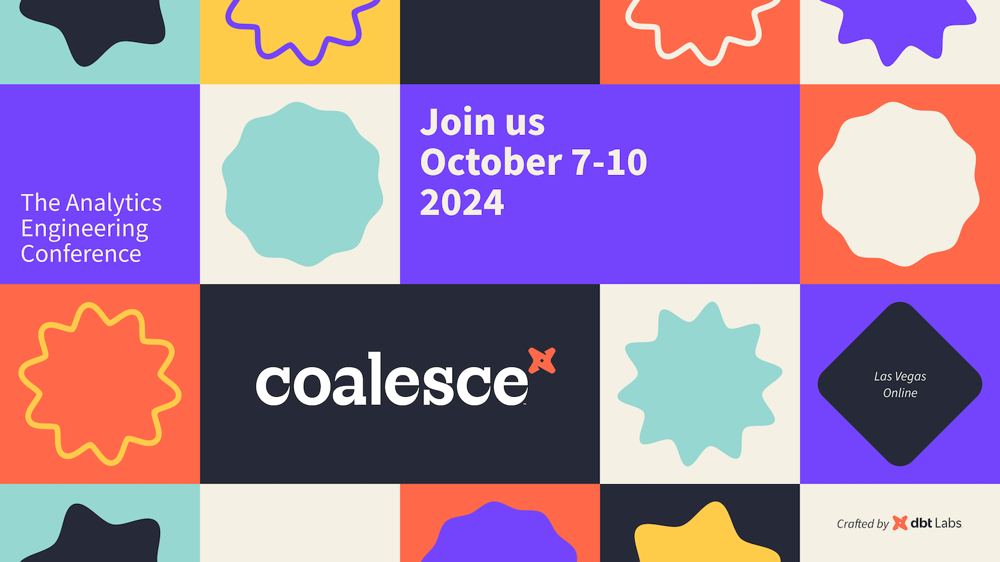

# Meet Recce at Coalesce 2024 and The Data Renegade Happy Hour
The Recce team will be joining [Coalesce 2024](https://coalesce.getdbt.com/) in Las Vegas! Meet our founder, [CL Kao](https://www.linkedin.com/in/clkao/), and product manager, [Karen Hsieh](https://www.linkedin.com/in/karenhsieh/), who has also been hosting the Taipei dbt meetups. As a company focused on helping data teams prevent bad merges and improve data quality, we believe Coalesce is the perfect venue to connect with fellow data professionals, share insights, and gain fresh perspectives.

<figure markdown="span">
  
  <figcaption>Coalesce 2024</figcaption>
</figure>

At Recce, our mission is to transform the data PR review process, ensuring that data pipelines not only run smoothly but also deliver accurate, validated results. We believe that data should be correct, collaborative, and continuously improved. Coalesce 2024 offers an ideal platform for these crucial conversations, gathering experts across the field to discuss the future of data management. Whether it’s gaining new insights into best practices or forging valuable partnerships, Coalesce is where we aim to make an impact.

<!-- more -->

## Coalesce provides invaluable insights
This journey didn’t start overnight. The idea for Recce was born from deep conversations with data practitioners at Coalesce 2023 in San Diego. At the time, CL Kao was working on PipeRider, a data impact assessment tool for dbt data projects.

It became clear from the conversations that the need for a more comprehensive solution—something beyond data comparisons and observability—was critical. From those learnings, CL pivoted PipeRider into what is now Recce, focused on improving the entire data PR review process. Coalesce 2023 provided invaluable insights, and this year, we’re returning with an even stronger vision.

[The Analytics Development Lifecycle (ADLC) white paper](https://www.getdbt.com/resources/guides/the-analytics-development-lifecycle) sets the stage for the discussions at Coalesce, and we’re eager to dive in. Trends like DataOps, automation, collaboration and data quality resonates deeply with Recce’s goals. While modern data practices draw significant inspiration from software engineering, data has its own unique challenges. One such challenge is that simply applying software methods directly to data isn’t always effective. Data review, for example, requires more than just SQL code reviews; it demands a thorough examination of the actual data.

## The Data Renegade Happy Hour: Where Data Power Meets Happy Hour

*It’s not just all work! Coalesce also gives us the chance to let loose and connect in a more relaxed setting. That’s why we’re teaming up with some of the brightest minds in data to co-host a special event:*

Join the team from Recce and [Tobiko](https://tobikodata.com/), [Cube](https://cube.dev/), [Paradime.io](https://www.paradime.io/), [Datacoves](https://datacoves.com/), and [Steep](https://steep.app/) on **October 8th** at the Data Renegade Happy Hour.

<figure markdown="span">
  
  <figcaption>Data Renegade Happy Hour</figcaption>
</figure>

It’s set to be a fun-filled evening where you can connect with industry pros over witty banter, enjoy data-themed cocktails, and be amazed by world-class magic from international champion John George.
Don’t miss the perfect blend of insights and entertainment.
 **[RSVP Soon](https://cube.registration.goldcast.io/events/09364877-fe00-4531-8923-8d80c8614ff1?utm_source=partner&utm_medium=&UTM_Publisher=&leadsource=&utm_campaign=&campaign_code=&campaignid=&utm_content=Recce#Registration), space is limited!**

[RSVP Today!](https://cube.registration.goldcast.io/events/09364877-fe00-4531-8923-8d80c8614ff1?utm_source=partner&utm_medium=&UTM_Publisher=&leadsource=&utm_campaign=&campaign_code=&campaignid=&utm_content=Recce#Registration){ .md-button .md-button--primary }

## Chat with us
We are looking forward to engaging with the data community on some of the most pressing challenges facing teams today, including how to prevent bad merges, validate results, and perform robust impact analysis. Every data practitioner who’s ever created or reviewed a PR knows the frustration of spot checks and incomplete data analysis.

We’re also curious to understand what’s holding teams back from addressing these issues. Why do 74% of business stakeholders report revenue loss due to poor data quality, yet many data teams still struggle to prioritize improvements? Everyone talks about the need for high-quality data, but not everyone is taking action. We want to hear how different industries, company sizes, and data teams approach these challenges and discuss how Recce can play a role in solving them—or even understand why Recce might not be the right fit in some cases.

Stay tuned for more details about where to find us during the event! We can’t wait to meet you all, exchange ideas, and explore how we can transform the way data is managed—stickers and limited swags are waiting for you, too.