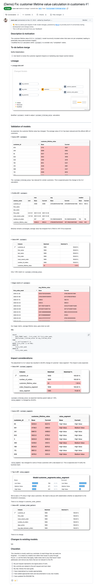

# The Ultimate PR Comment Template Boilerplate for dbt data projects

If you’re looking to level-up your dbt game and improve the PR review process for your team, then using a [PR comment template](https://gist.github.com/DaveFlynn/b8ade60b531a07a3b26772ee6d55e80b) is essential. 

A PR template is a markdown-formatted boilerplate comment that you copy and paste into the comment box when opening a PR. You then fill out the relevant sections and submit the comment with your PR.

<figure markdown="span">
  
  <figcaption>Example of a PR comment with comprehensive data validation checks</figcaption>
</figure>

## The benefits of using a PR comment template

The sections in the template help by providing a systematic approach to defining and checking your work. Having a template also helps to avoid ambiguous or superficial comments which make PRs difficult to review. The benefits of using a PR comment template for modern dbt dataops are:

<!-- more -->

1. As the PR author, the structure of the template helps you to **define and describe your work** related to this PR, which helps to you to perform data validation and understand data impact.
2. As the PR reviewer, the sections **help you to review the PR by following the logical steps** that the author took by seeing exactly what work as done, and how it was checked. Making data quality and data integrity checks integral to the PR review process. 
3. For future you, **it provides a historical record** of what was done and why, which is invaluable as part of data best practices. 

Check the end of the article for some examples from the data projects of Prefeitura do Rio de Janeiro and the California Integrated Travel Project (Cal-ITP), who both make deft use or PR comment templates to improve their pull request process.

## Where can you get a dbt PR comment template from?

dbt provides an [official pull request template](https://docs.getdbt.com/blog/analytics-pull-request-template) that you can paste into your comment when you open a PR. It’s a great template, and an essential foundation to dbt best practices but, due to the complicated nature of reviewing dbt data project pull requests, there's still room for improvement.

### The official dbt PR comment template

The official dbt template includes the following sections:

- Description & motivation
- To-do before merge
- Screenshots
- Validation of models
- Changes to existing models
- Checklist (of small things that are sometimes overlooked)

At [Recce](https://datarecce.io), we’re all about validating your work - providing the proof-of-correctness that shows why your work is complete and the PR can be merged. So, we feel this PR comment template can be improved to make it even better suited to this job.

Let’s add a few new sections, and update/re-define some of the existing sections to make them clearer.

<figure markdown="span">
  
  <figcaption>What sections should the perfect PR comment contain?</figcaption>
</figure>

## Making a better PR comment template for dbt data projects

To improve the dbt PR comment template and make your data quality check processes even better, we can start with adding some new sections that will clarify the purpose of the PR and make it easier to review.

### Type of change

Classifying the type of change helps to frame the work. It guides the PR author toward the type of validations they should run based on the category of work, and the reviewer will have an initial idea how to properly review the work 

A sensible set of change types to start with could be as follows:

- [ ]  New model
- [ ]  Bugfix
- [ ]  Refactoring
- [ ]  Breaking change
- [ ]  Documentation
- [ ]  (Other project-specific item)

### Related Issues

Discussion surrounding a piece of work can happen anywhere, and likely starts with a ticket, chat, or Github issue etc. Provide links to any related discussion that can help clarify your work. This is essential to validating data quality with context. (dbt covers this in the ‘description’ section, but I prefer to have this in its own section.)

### Impact considerations

In this section, include validation on how downstream models have/have not been impacted and what considerations are required. This is crucial for understanding data impact and helps ensure that critical models or exposures remain unaffected. As with `validation of models`, use screenshots and queries to illustrate the impact.

## Updated Sections

Some of the sections could also be better defined, and potential use clarified:

### Screenshots → Lineage DAG/Diff

You can use screenshots anywhere in the PR comment, so let’s change this section to be ‘Lineage DAG’ and use it for specifically showing the parts of the DAG that have been impacted by this PR. This is where you’d share the [Lineage Diff](https://datarecce.io/docs/features/lineage/) screenshot from Recce that shows only the `modified+` part of the DAG after comparing it to before you made any changes.

### Validation of models

This is how you prove that your work is correct and complete. Arguably the most important section of the PR comment as it’s how the reviewer will know that you’ve conducted a thorough data validation.

*The dbt template mentions sharing dbt test results in this section, but depending on the size of the your project, the test results might crowd out important, PR-specific, data validations. So we’ve moved dbt test results to their own section below.*

This section should consist of custom queries, profiling stats, data quality checks, data comparisons, and diffs, examples of data impact, anything that helps to validate your work and serve as proof-of-correctness. **Use the Recce data validation toolkit to check your work**, and include any of the relevant check results, such as

- [**Ad-hoc queries**](https://datarecce.io/docs/features/query/) — Spot-check queries to confirm the results are as expected
- [**Profiling stats**](https://datarecce.io/docs/features/lineage/#profile-diff) — Do you see the expected impact in the overall profile of the data
- [**Value diff stats**](https://datarecce.io/docs/features/lineage/#value-diff) — Compare the percentage of matched rows between dev and prod
- [**Profile diff**](https://datarecce.io/docs/features/lineage/#profile-diff) — A statistical comparison of dev and prod
- [**Schema diff**](https://datarecce.io/docs/features/lineage/#schema-diff) — If the schema has changed and if it’s intended

**Take screenshots of the checks that you ran and post them as validation of models.**

!!! info "Pro Tip"
    
    Export the Recce State File and attach it to PR comment. The Recce State File contains your checks and the PR reviewer will be able to load the checks in Review Mode to view the results.

### dbt test results

As mentioned above, depending on the size of your project, you may consider moving dbt test results to their own section. This enables your validation of models section to focus on the checks that help to validate your PR-specific work.

## The updated PR comment template for dbt data projects

Here’s the [updated PR comment template](https://gist.github.com/DaveFlynn/b8ade60b531a07a3b26772ee6d55e80b) that you can use to adapt for your needs. As mentioned, this is adapted directly from the [official dbt example](https://docs.getdbt.com/blog/analytics-pull-request-template), with the changes that were detailed above applied. By aligning with dbt best practices, and augmenting with Recce data checks, this template enhances data integrity and supports a more streamlined PR review process.

## What a PR Template looks like in-action

To see what this PR comment looks like in action check out this [demo PR comment](https://github.com/DataRecce/jaffle_shop_duckdb/pull/1) that shows how using this template together with Recce data validation checks, can create the ultimate PR comment. The data quality check results listed help ensure data impact is accurately assessed.

If every PR comment had the data validation check results listed, you’d be able to sign-off a PR and merge in no time.

<figure markdown="span">
  
  <figcaption>A demo showing a PR comment template in use with Recce data validations</figcaption>
</figure>

## Who’s using PR comment templates like this?

For teams who collaborate on data changes and hold data integrity in high regard, the use of a PR comment templates can streamline the PR review process. As is demonstrated in these real-world examples.

### Municipal government of Rio de Janeiro

A great example of a PR template in action is by data team for the municipal government of Rio de Janeiro (Prefeitura do Rio de Janeiro). The team there uses a PR template and [Recce checks](https://github.com/prefeitura-rio/queries-rj-sms/pull/44#issuecomment-2179250072) for their [validation of models](https://github.com/prefeitura-rio/queries-rj-sms/pull/45#issuecomment-2201078519), ensuring data quality and data integrity throughout the data review process:

<figure markdown="span">
  
  <figcaption>Prefeitura do Rio de Janeiro uses Recce in their pr comment</figcaption>
</figure>

### The California Integrated Travel Project (Cal-ITP)

Cal-ITP is a [textbook example](https://github.com/cal-itp/data-infra/pull/3159) of dbt best practices with their extensively detailed PR comments, and supplemental data impact assessments.

- Previous and resolved issues are linked.
- The work is clearly described with reasoning.
- The reviewer is tagged with questions about changes.
- Post-merge actions are defined, adhering to dataops best practices.

<figure markdown="span">
  
  <figcaption>Cal-ITP is a textbook example of data due diligence</figcaption>
</figure>

## Conclusion

Using a PR comment template for dbt projects is an excellent way to streamline the pull request process, ensuring that both authors and reviewers are aligned on what changes have been made and how those changes have been validated. 

The updated PR comment template not only helps to define the work contained in the PR, but also helps the PR author to consider and anticipates the types of data impact that may occur. Using Recce’s data validation checks, such as spot-check queries, profile diffs, and schema comparisons, the validation process is standardized, which helps speed up the PR review and time-to-merge.  

Teams like Cal-ITP and the municipal government of Rio de Janeiro have adopted PR comment templates and use them as part of their PR process to improve reviewability and ensure data integrity.

For your dbt projects, use this structured approach to PR comments to achieve faster, more thorough reviews, and ensure that any changes you introduce follow dbt best practices and are well-documented and correctly validated before merging.
