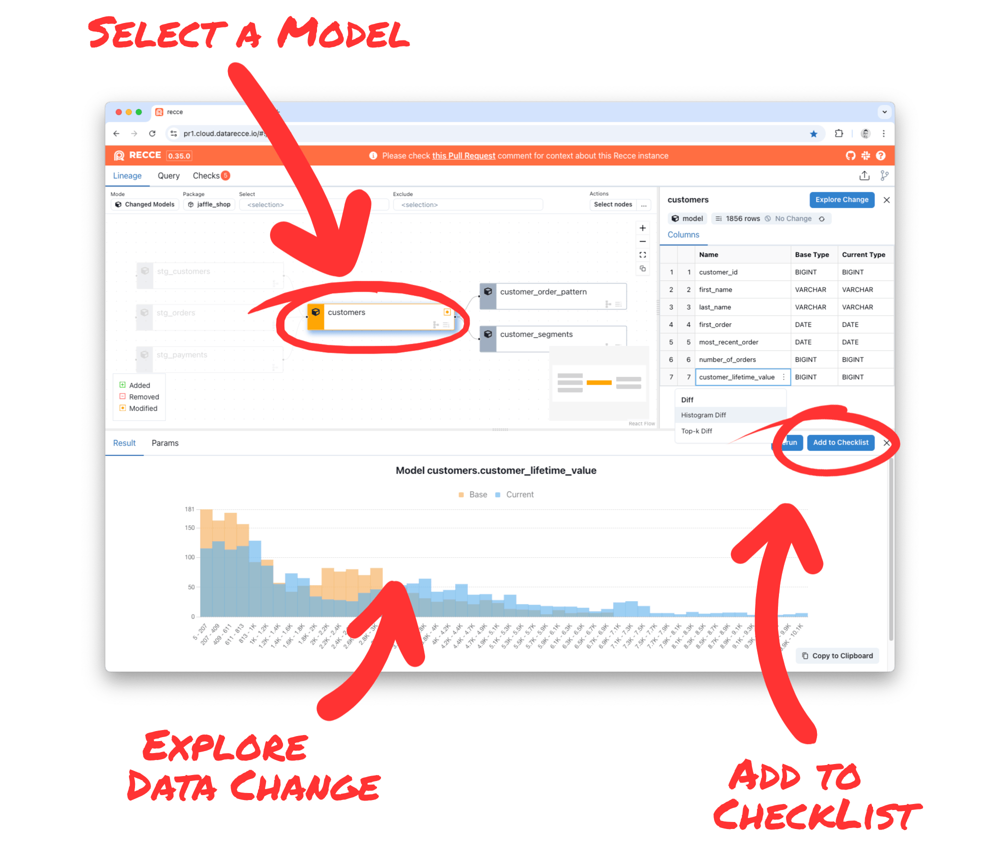

# Explore data impact and focus on tracking data validations with Recce's new interface

There’s nothing worse than being distracted while you’re in the middle of working on a complex task or debugging an issue.  All the things that you were juggling in your mind come crashing down, and you have to pick up the pieces and start again.

Recce's updated interface lets you stay on track while assessing and exploring data impact in your dbt project when making dbt data model changes, and performing dbt PR review.

<iframe src="https://www.loom.com/embed/66959ea08b164e9190703d67877153dd?sid=8d5a9edb-9e54-49e0-b86f-2b18f15b2f2c" frameborder="0" webkitallowfullscreen mozallowfullscreen allowfullscreen style="position: absolute; top: 0; left: 0; width: 100%; height: 100%;"></iframe>

## Track and record data impact assessment results

Staying in context is especially important when you’re running data validations to verify your dbt data models, exploring data change and impact, or finding the root cause of a data incident. You need to:

<!-- more -->

- Keep track of the **data models** that you are checking.
- Keep track of the type of **data validations** that you are running.
- Record the **results** of your data validations and impact checks.
- Record the **meaning** of the results.

It’s important to record and track these things as you validate your work during data modeling, and then also after opening a PR on your dbt data project.

## How to explore data impact without being distracted

This is why, in the latest version of Recce, you can stay in context while adding data validation checks and continue from where you left off after adding a check. 

1. **Explore changes** in your dbt data project by running data validations.
2. **Add a data validation check** to your checklist.
3. **Continue** where you left off.

<figure markdown="span">
  
  <figcaption>Explore data impact and focus on tracking data validations with Recce's updated interface</figcaption>
</figure>

## Data comparison results show potential impact

When exploring data impact with Recce, the Lineage Diff is the main interface. The default view is `modified+` and so represents the potential impact radius of your changes. 

Lineage Diff is where you’ll focus your data impact assessment efforts, so it’s essential that it stays visible during your exploration. This means you can stay focused on your job of validating the correctness of your work, without having to leave your train-of-thought to view results on another page.

### Perform multiple checks without losing context

Now, when you run a diff, the results are shown in the the panel below. There’s no need to leave the lineage diff interface; and you can see the lineage, schema, and diff results, all displayed together.

If you do add the results of a diff to your checklist, when you return to the Lineage view, everything is exactly as you left it, so you can continue your work.

### Model and row-level diffs

You can also run model-level diffs such as data profiling, or column-level diffs like histogram and top-k, right from the main interface. The results for each diff will be shown right below the lineage.

The new interface means you can find and explore data impact without losing your flow state. Then, when you’ve got the check results you need, add them to your checklist.

## Save and share data checks with your team for PR review

To save a diff to your checklist, click the ‘Add to Checklist’ button and you’ll be taken to the checklist to add your check annotation. Then go back to the Lineage tab to continue where you left off.

When you’ve finished your data validation work, you can export the checklist as a Recce File and share with your colleagues, or add checks to your PR comment. ***If you’re a Recce Cloud user, your checks and approval status will be automatically synced.***

## Join us to make data productive

For early access to [Recce Cloud](https://datarecce.io/cloud/), and a hand in making Recce better meet your needs, [book a meeting](https://cal.com/team/recce/chat) for a demo and chat. We're looking forward to hearing from you!
