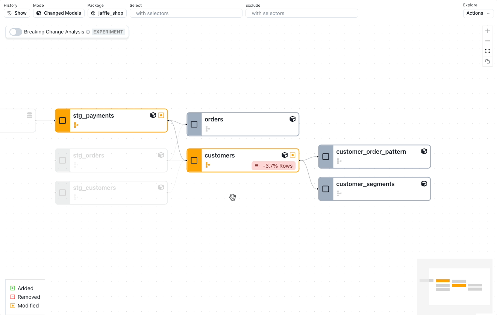

# Recce: Your data change management toolkit

Whether you’re the author of a pull request or the one reviewing it, you’ve got a tough job: figuring out what changed, verifying that the PR does what it’s supposed to, and making sure nothing breaks in production. In large or business-critical dbt projects, this can be a slow, frustrating process. That’s why we built Recce - an open-source toolkit that’s here to make your data modeling validation and pull request (PR) reviews a breeze.

<figure markdown="span">
  
  <figcaption>Build the ultimate PR comment to validate your dbt data modeling changes</figcaption>
</figure>

## What is Recce?

Recce (pronounced “reh-kee”, short for “reconnaissance”) is a suite of change management tools designed to help you compare dbt environments, assess data impacts, and streamline your PR reviews. Recce gives you visibility into the effects of your data modeling changes *before* they hit production. With Recce, you can **take two dbt environments, such as dev and prod, and compare them using the suite of diff tools.**

<!-- more -->

## Your diffing toolkit

With Recce you’re able to validate your data modeling changes against a known-good baseline, comparing datasets before and after your modifications, in a risk-free environment. And there’s a diff for every occasion.

### Lineage DAG diff

Start from the zone of impact of your changes, and see which models have been modified, added, and removed. Unlike the dbt docs lineage DAG, which only shows you the current state of the DAG, Recce shows you how the DAG differs from both before and after your changes.

<figure markdown="span">
  
  <figcaption>See modified, added, and removed dbt models with breaking change analysis</figcaption>
</figure>

### Data profile diff and value diff

Perform holistic checks by diffing the data profile stats for your development branch, then check the percentage of values matching for each column in a model.

<figure markdown="span">
  
  <figcaption>Perform holistic checks by diffing data profile stats</figcaption>
</figure>

### Query diff

If something needs further investigation, drill down and query the data. One query will run on both environments, and you’ll be able to see the difference on a row-by-row basis. Enable change-only view to see just what’s changed.

<figure markdown="span">
  
  <figcaption>Drill down and query the data</figcaption>
</figure>

## Schema and row count

In addition to the above diffs, you can also check the schema and row count, just to be sure you didn’t lose any data, or an important column.

<figure markdown="span">
  
  <figcaption>Ensure data integrity with schema and row count checks</figcaption>
</figure>

## You’ve been hard at work, time to show it

As you create validations in Recce, you can add them to your curated checklist with notes about what you found, and re-re-run checks if the data changes.

<figure markdown="span">
  
  <figcaption>Curate a data validation checklist</figcaption>
</figure>

Once you’ve validated your changes, it’s time to share your work. Recce lets you export your checks directly into your [PR comment template](https://medium.com/inthepipeline/use-this-updated-pull-request-comment-template-for-your-dbt-data-projects-de06f12fc38d), so you can provide clear, proof-of-correctness evidence. You can copy key notes, grab a screenshot of the validation results, and include only the relevant details, keeping your PR comment **all-signal, no noise**.

For reviewers, this means they can quickly see the queries and results of your data spot-checks, making it easy to assess the impact of your changes. With all the context at hand, they can either ask for further investigation or confidently approve the PR.

<figure markdown="span">
  
  <figcaption>Level up your PR comments</figcaption>
</figure>

  ## Getting started with Recce

Ready to revolutionize your data review process? Recce is open-source and easy to integrate into your workflow.

Recce OSS is available on GitHub. Follow the instructions in our Getting Started guide to start using Recce to validate your data modeling changes.

- **GitHub**: [DataRecce/Recce](https://github.com/datarecce/recce)
- **Docs**: [DataRecce.io/docs](https://datarecce.io/docs)
- **Discord**: [Recce Community](https://discord.gg/bP2Yfk9KEA)

### Try Recce Online

If you want to try Recce out without having to install, check out our demo instance.

### Demo

The [demo PR](https://github.com/DataRecce/jaffle_shop_duckdb/pull/1) makes a simple change to the dbt’s Jaffle Shop project and changes how `customer_lifetime_value` (CLV) is calculated by fixing the calculation to only evaluate *completed* orders.

<figure markdown="span">
  
  <figcaption>Code Diff in Recce</figcaption>
</figure>

The expectation from this change is that CLV will be reduced overall, and that this will also impact the customer segments downstream model. With that in mind, see if you can determine if the if the PR has any issues by checking the data in Recce:

- **The PR:** [https://github.com/DataRecce/jaffle_shop_duckdb/pull/1](https://github.com/DataRecce/jaffle_shop_duckdb/pull/1)
- **Recce Demo instance**: [https://pr1.cloud.datarecce.io/](https://pr1.cloud.datarecce.io/)

*Hint: Run a Profile Diff, then a Query Diff, on the customers model. Then check for downstream impact.*

For even more details on using Recce to perform data impact assessment, check out our [hands-on guide](https://medium.com/inthepipeline/hands-on-data-impact-analysis-with-recce-80ea4156c6ec).

### Start shipping data models with confidence with Recce

Data modeling changes shouldn’t feel like a gamble. Whether you’re the one writing the PR or the one reviewing it, you need confidence that what’s changing is actually what was intended —without breaking production. Recce gives you the tools to compare environments, validate your data, and surface meaningful insights, all while keeping PR comments focused and actionable. 

If you’re tired of [slow QA cycles](https://medium.com/inthepipeline/dbt-best-practices-are-in-but-merge-times-are-up-49f72a792680), silent data errors, and [bloated CI pipelines](https://medium.com/inthepipeline/so-you-think-youve-got-dbt-test-bloat-37491fb330d5), it’s time to give Recce a shot.

