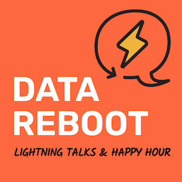

# Meet Recce at Data Council and Data Reboot, Data Renegades Happy Hour
[Data Council](https://www.datacouncil.ai/bay-2025) is one of our favorite conferences: thousands of Data & AI practitioners, hundreds of cutting-edge talks, and endless opportunities to connect and be inspired. If you're in the data space, it's the event you don’t want to miss.

At Recce, we love talking to people who’ve encountered the challenges we’re passionate about. We believe data development is fundamentally different from software development. Yes, modern data teams borrow practices from software — version control, CI/CD, testing. But data comes with ambiguity. A 0.5% change in daily active customers might not mean much without business context. Is it correct? Is it broken? It depends.

<!-- more -->

More and more data teams are feeling this. Reviewing a SQL snippet isn’t enough.Context matters. How do teams work with the business to spot the real impact of changes? How do we prevent bad data from slipping into production unnoticed?

To explore these questions and meet fellow data practitioners, we’re hosting two events at Data Council 2025:

### Monday: Data Reboot — Lightning Talks + Happy Hour
<figure markdown="span">
  
  <figcaption>Data Reboot</figcaption>
</figure>

Kick off the week with short, fun, and thought-provoking talks. Then grab a drink and meet fellow attendees before the main conference starts.

📅 Date: Mon 21st April 2025, 6-9 PM

📍Place: Near the conference

 🎫 RSVP: [lu.ma/ro29lcyb](https://lu.ma/ro29lcyb)

### Tuesday: Data Renegades — Break the Rules, Build the Future
<figure markdown="span">
  
  <figcaption>Data Renegades</figcaption>
</figure>

A casual happy hour with bold conversations, lessons learned, and good company. Co-hosted with [Tobiko Data](https://tobikodata.com/), [Datacoves](https://datacoves.com/), and [Bauplan](https://www.bauplanlabs.com/), this is your chance to connect, unwind, and trade ideas with fellow rebels in data.

📅 Date: Tue 22nd April 2025, 7-10 PM

📍Place: Sobre Mesa

🎫 RSVP: [lu.ma/ctsozuun](https://lu.ma/ctsozuun)

Throughout the conference, we’d love to hear from you. Whether it’s about CI/CD for data, bridging business and data gaps, or building confidence in your data PR workflow, come say hi! 👋
