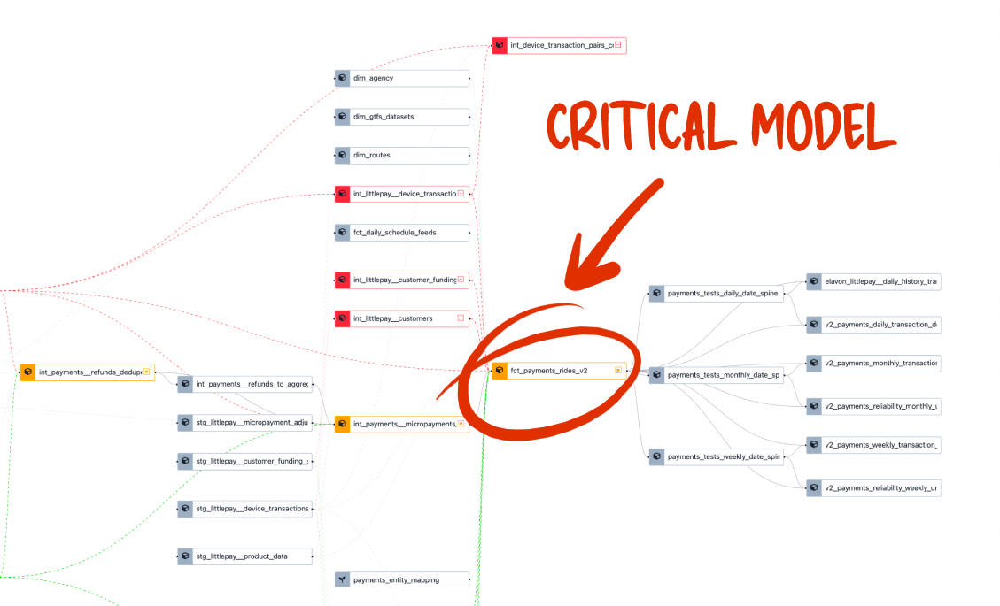
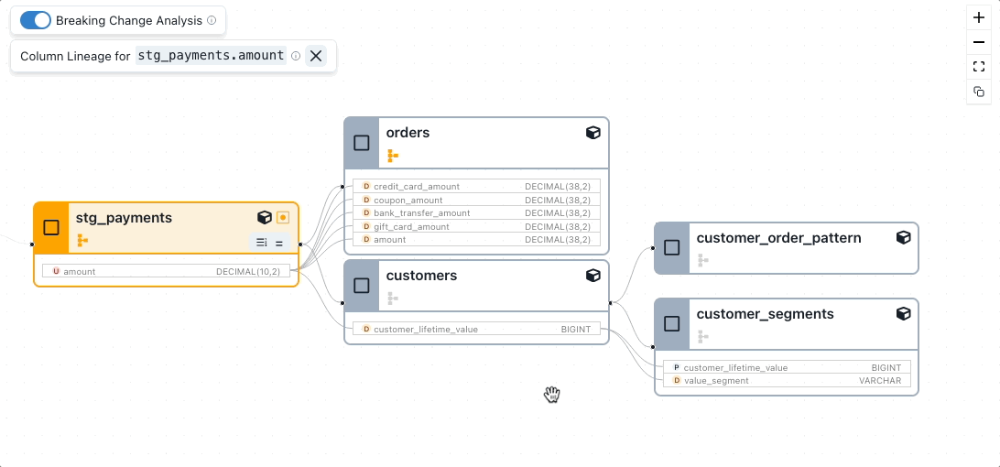
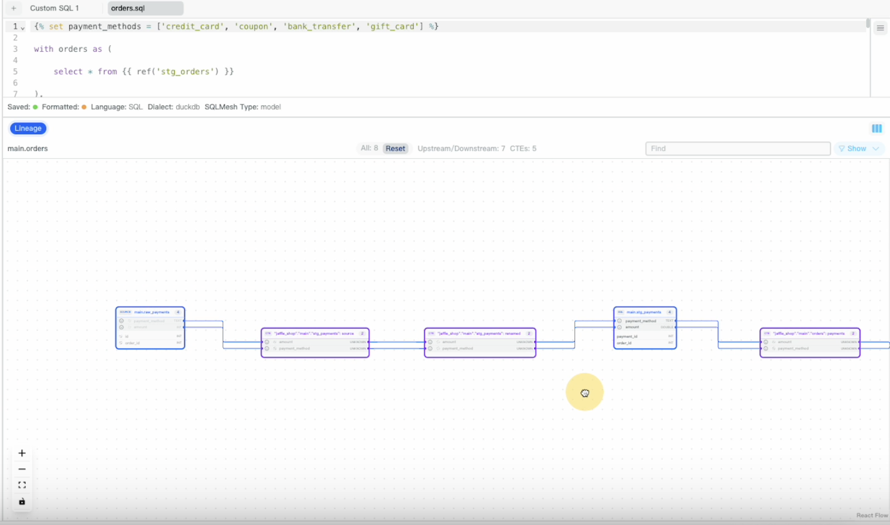

# Why Column-Level Lineage Matters for dbt: Comparing the Options

Column-level lineage was a hot topic during 2024, with many data platforms and tools adding this feature to their software and boasting the benefits of column-level lineage for data workflows.

In this article, I’ll take a look at **how column-level lineage works in dbt, in both open-source and dbt Cloud, and through SQLMesh**; and see how the usage and workflow differs between these platforms.

<figure markdown="span">
  
  <figcaption>Column-level lineage in dbt Explorer showing columns as nodes</figcaption>
</figure>

Seeing lineage in your transformation platform, especially during data modeling updates, is particularly important because it’s at this stage that you most need to understand the impact of your actions.

<!-- more -->

## Why model and column-level lineage matter

**Model-level lineage** is already extremely valuable. It’s the main interface for performing data validation in [Recce](https://github.com/datarecce/recce) (through the unique lineage diff view), and provides a holistic overview of your data project which supports the analysis of data flow for root cause and data impact assessment work.

As data projects become more complex, the use of lineage DAGs for visualization becomes more and more important. If you’re making a change to a [critical model](https://medium.com/inthepipeline/identify-and-automate-data-checks-on-critical-dbt-models-44c988406d5f) that is used in many downstream metrics, or a bottleneck model with 100s of downstream, being able to actually see those models is invaluable.

<figure markdown="span">
  
  <figcaption>Example of Lineage Diff in Recce - invaluable for identifying critical models</figcaption>
</figure>

While model-level lineage gives you a high-level view of data flow, it doesn’t tell you how specific columns are evolving through the data project in transformations — that’s where column-level lineages comes in.

## Take it to the next (column) level

**Column-level lineage** takes it to the next level, literally, by providing a more in-depth look at how data moves through your data project. Tracking the evolution of a column, and the data it contains, helps you to analyze exactly why the numbers are the way they are, and where they’re going next.

Common use-cases for column-level lineage are:

1. Source Exploration: During development, column-level lineage helps you understand how a column is derived.
2. Impact Analysis: When modifying the logic of a column, column-level lineage enables you to assess the potential impact across the entire DAG.
3. Root Cause Analysis: Column-level lineage helps identify the possible source of errors by tracing data lineage at the column level.

***Rather than use pros and cons for each platform, I’ve highlighted the key points for each platform. This is because your specific use-case will determine whether these points are pros or cons.***

Let’s dive in.

## dbt column-level lineage

There are two main ways to access column-level lineage for dbt:

- The open-source Power User for dbt (VSCode plugin)
- dbt Cloud as part of dbt Explorer (for dbt Cloud Enterprise customers)

Let’s take a look at how column-level lineage is used via each of these methods:

### Power User for dbt (VSCode dbt power user)

[Power User for dbt](https://github.com/AltimateAI/vscode-dbt-power-user) is an open-source VSCode extension and, as the name suggests, brings advanced dbt-related features right into your code editor. Both model and column-level lineage are available and can be viewed in a VSCode panel.

<figure markdown="span">
  
  <figcaption>Power User for dbt shows column-level lineage in withing your code editor</figcaption>
</figure>

The model-level lineage shows the node type, and also has a high degree of control over the number of parent and child nodes you want to show.

<figure markdown="span">
  
  <figcaption>Control the number of parent and child nodes you want to show</figcaption>
</figure>

#### How to enable column-level lineage in dbt Power user

To use column-level lineage you currently need to enable the beta version by clicking the `Show New UX (Beta)` button. After that, you can view column-level lineage by:

- Clicking a node in the lineage
- Clicking a column in the details panel

<figure markdown="span">
  
  <figcaption>Viewing column-level lineage in Power User for dbt</figcaption>
</figure>

The lineage also shows if the column was transformed, and you can view the [code transformations](https://docs.myaltimate.com/test/lineage/#code-transformations) that took place.

If you use VSCode, having model and column-level lineage right is a huge convenience, especially as the column-level lineage is shown as part of the model lineage!

Highlights of column-level lineage in dbt Power User

- Open-source and free to use (An API key is required from Altimate)
- Runs in VSCode so helps you stay on-task
- Part of a full-featured lineage feature

### dbt Explorer column-level lineage in dbt Cloud

[Column-level lineage](https://docs.getdbt.com/docs/collaborate/column-level-lineage) in dbt Cloud is available in dbt Explorer, which is part of dbt’s Enterprise offering. dbt positions the column-level lineage feature as a way to understand the lay of the land before making any changes to your project.

  <iframe width="560" height="315" src="https://www.youtube.com/embed/wdxtzNujVx0?si=BYqJsIWfiT5-GeJb" title="YouTube video player" frameborder="0" allow="accelerometer; autoplay; clipboard-write; encrypted-media; gyroscope; picture-in-picture; web-share" referrerpolicy="strict-origin-when-cross-origin" allowfullscreen></iframe>

#### A lens on lineage

From the model-level lineage, which contains lineage ‘lens’ to toggle various views, you can select a model and view the column evolution. As **column-level lineage is viewed separately from the model lineage**, it reduces the speed at which you can inspect multiple column lineages because you have to go in and out of the model details pages.

#### Columns become nodes

Also of note is that rather than group columns by model, **each column is shown as a distinct node on the lineage**. For instance, in the screenshot below, there are two nodes used to represent the columns `EXTENDED_PRICE` and `QUANTITY` that are both from the one model, `stg_tphc_line_items`. As mentioned above, your personal preference will determine the usability of this implementation.

<figure markdown="span">
  
  <figcaption>Column-level lineage in dbt Explorer showing columns as nodes</figcaption>
</figure>

#### Highlights of column-level lineage in dbt Explorer

- Only available to dbt Enterprise customers
- Column-level lineage is shown separately from the model-level lineage
- Columns are shown as distinct nodes in the lineage

### Recce: column-level lineage for data model validation

Open-source data-model validation tool, [Recce](https://github.com/datarecce/recce), also recently added column lineage as part of its impact assessment workflow.

<figure markdown="span">
  
  <figcaption>Select and follow a column’s evolution from the main lineage DAG in Recce</figcaption>
</figure>

Column-lineage in Recce is shown directly on the lineage DAG (in Recce it’s actually a lineage DAG diff), so you can easily click about and inspect the lineage of various columns, while staying on the task of checking which models are impacted by your data modeling changes. Each column also displays the type of transformation that has taken place, such as derived (transformed), renamed, or simply passed-through.

As mentioned, Recce positions the column-lineage as a method to help with impact assessment, which makes sense when you have a bunch of models to check after updating an upstream model — knowing which models use that column can be very useful.

#### Highlights of column-level lineage in Recce

- Open-source version is free to use
- Column information is displayed on the main lineage DAG
- Part of a larger data-validation workflow

## SQLMesh column-level lineage

SQLMesh, the data transformation platform that quickly emerged as the primary competitor to dbt, integrates many features into it’s open-source offering.

In addition to data transformation, impact analysis, audits, blue/green deployments, column-level lineage is also an integral part of the platform. Notably, SQLMesh actually enables [column-level lineage for dbt](https://tobikodata.com/column_level_lineage_for_dbt.html) projects.

<figure markdown="span">
  
  <figcaption>SQLMesh runs in the browser with lineage segments easily accessible</figcaption>
</figure>

SQLMesh runs in a browser, and accessing the related lineage for each model is as easy as clicking the model in the catalog or file view.

The SQLMesh column-level lineage is unique from the other implementations, and more opinionated, for a few reasons.

### CTEs become nodes

The first reason is that CTEs are displayed as nodes in the column-level view. It’s a interesting choice, but could result in information overload if your DAG is very busy.

<figure markdown="span">
  
  <figcaption>CTEs are shown as nodes in the column-level lineage view</figcaption>
</figure>

### Heads-up(stream)

The second is that only the upstream lineage is shown. For instance, in the screenshot below only the upstream column usage of the `amount` column is shown, the downstream is not.

<figure markdown="span">
  
  <figcaption>Only the upstream lineage is shown in column-level in SQLMesh</figcaption>
</figure>

This is why I described this as a more opinionated implementation. I suppose the expectation is — you’re looking at a number and you want to know how that number came to be, so naturally you want to look upstream.

### Refresh, refresh, refresh

One issue with navigating lineage in SQLMesh is the constant reloading. Each time you click a node the whole lineage is refreshed. This makes it incredibly difficult to assess lineage, while at the same time keeping track of where you are in the bigger picture.

<figure markdown="span">
  
  <figcaption>Each click results in a full refresh, which can be a little disorientating</figcaption>
</figure>

This refresh remains for going from project to column-level lineage. Again, making it possible to lose that thread.

### Highlights of Column-level lineage in SQLMesh

- Native feature of SQLMesh
- Open-source
- The lineage reloads when selecting a node which can be distracting
- Only the upstream lineage is shown
- CTEs are shown on the lineage as nodes

## Additional considerations

Just tracking how data flows through columns is useful, but there are other considerations to take into account when exploring data impact. If and how a column was transformed can offer greater insight into which nodes you need to focus on for root cause analysis. Also, keep in mind that columns used in filtering or joins may not appear in column-level lineage as being ‘used’ in that node.

### Column transformation type

One aspect of column-level lineage that is particularly useful for root cause analysis is knowing if a transformation occurred in the model.

When the column passed through this model, what happened to it?

- Transformed
- Passed-through
- Renamed

<figure markdown="span">
  
  <figcaption>Listing the transformations for a column in Power User for dbt (source: Power User for dbt documentation)</figcaption>
</figure>

If the column was transformed, then having the ability to view those transformations can further enable your work understanding more about a columns evolution.

### “Where” is the caveat

If a column is used downstream in a WHERE clause, or join, this does not count as the column being used in that model. Filtering and join conditions establish model relationships, but do not modify or transform the column data. Therefore, they will not be shown on the column-level lineage in most implementations.

## Conclusion

Each of the column-level lineage offerings above differs in slight ways that would inform the way you use them. In that regard, which is most useful to you would depend on your particular use-case. Implementation aside, there’s no denying the use of column-level lineage as a tool in impact assessment both before and after modeling changes, and in gaining a deep understanding of data flow through your data project.

Are you using one of the many column-level lineage tools? Which one are you using, is it good? Anything to correct in the summaries above? Please leave a comment!

