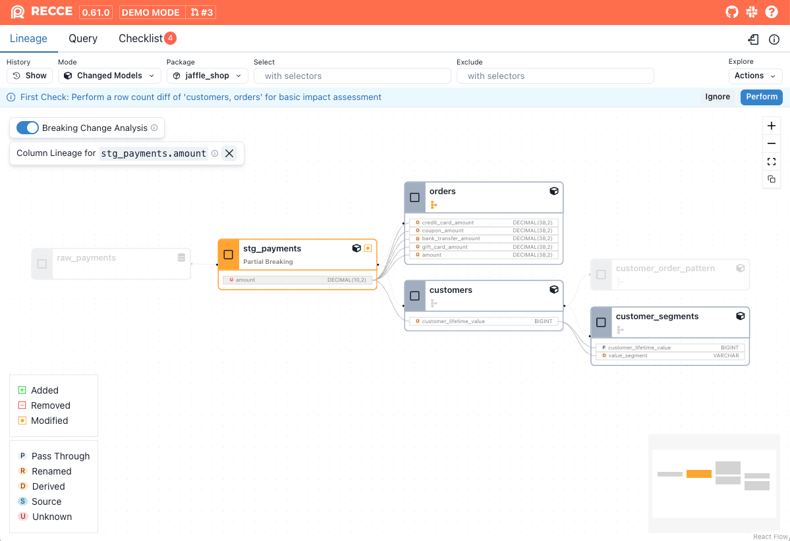

**Breaking Change Analysis** examines modified models and categorizes changes into three types:

- Breaking changes
- Partial breaking changes
- Non-breaking changes

It's generally assumed that any modification to a model’s SQL will affect all downstream models. However, not all changes have the same level of impact. For example, formatting adjustments or the addition of a new column should not break downstream dependencies. Breaking change analysis helps you assess whether a change affects downstream models and, if so, to what extent.

## Categories of change
Category | Downstream Impact | Examples
---|---|---
Non-breaking change | No downstream models are affected |  New column, formatting SQL, adding comments
Partial breaking change | Only downstream models referencing certain columns are affected | Removing, renaming, or modifying the definition of a column
Breaking change | All downstream models are affected | Changing filter conditions (e.g. `WHERE`), sort order (`ORDER BY`), or other SQL logic

## Usage

To enable **Breaking Change Analysis**, click the toggle on the  **Lineage** page. 

All modified models display their change category directly on the node. Additionally, partial breaking changes are highlighted with a dashed orange border to indicate that they may not impact downstream models.

=== "Disabled"
    
    {: .shadow}

=== "Enabled"
    
    {: .shadow}

## Column-Level Lineage

In models classified as **non-breaking** or **partial breaking** -  added, removed, or modified columns will be listed. Click on a column to open its [Column-Level Lineage](./column-level-lineage.md)

{: .shadow}

## Limitations

The current implementation of breaking change analysis is still very conservative. As a result, a modified model may be classified as a breaking change when it is actually non breaking or partial breaking changes. Common cases include:

1. Logical equivalence in operations, such as changing `a + b` to `b + a`.
1. Adding a `LEFT JOIN` to a table and selecting columns from it. This is often used to enrich the current model with additional dimension table data without affecting existing downstream tables.
1. All modified python models or seeds are treated as breaking change.

## Technology

Breaking Change Analysis is powered by the SQL analysis and AST diff capabilities of [SQLGlot](https://github.com/tobymao/sqlglot) to  compare two SQL semantic trees.