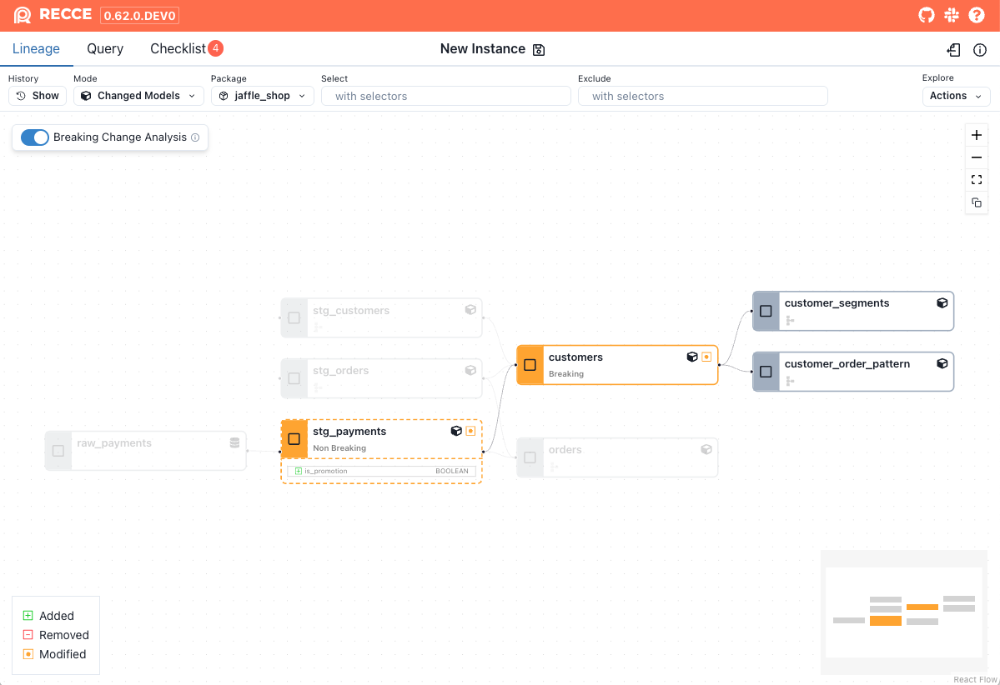

`Experimental Feature`

Breaking change analysis examines models for modifications to the SQL semantic tree that could potentially alter the data generated by the model, resulting in downstream impact.

Currently, all modified models are treated as **breaking changes** unless:

1. The semantics are unchanged.
1. The modification only involves adding a new column.

If no structural differences are detected or the changes involve simply adding new columns, the modification is classified as non-breaking changes.

## Usage

To enable the feature, click the **breaking Change Analysis** toggle on the  **Lineage** page. 

- Models with **breaking changes** can be identified by a solid orange border.
- Models with **non-breaking changes** can be identified by the dashed orange border.

=== "Disabled"
    
    {: .shadow}

=== "Enabled"
    
    {: .shadow}

## Limitations

The current implementation of breaking change analysis is still very conservative. As a result, a modified model may be classified as a breaking change when it is actually non-breaking. Common cases include:

1. Adding a column using a `CASE WHEN` statement.
1. Logical equivalence in operations, such as changing `a + b` to `b + a`.
1. Adding a `LEFT JOIN` to a table and selecting columns from it. This is often used to enrich the current model with additional dimension table data without affecting existing downstream tables.
1. All modified python models or seeds are treated as breaking change.

In some cases, breaking changes may be mistakenly identified as non-breaking changes, such as:

1. Adding a new column can result in a table expansion effect, similar to the functionality of DuckDB's [unnest function](https://duckdb.org/docs/sql/query_syntax/unnest.html). The unnest function flattens lists or structs, potentially transforming a single upstream row into multiple downstream rows.

## Technology

Breaking Change Analysis is powered by the SQL analysis and AST diff capabilities of [SQLGlot](https://github.com/tobymao/sqlglot) to  compare two SQL semantic trees.