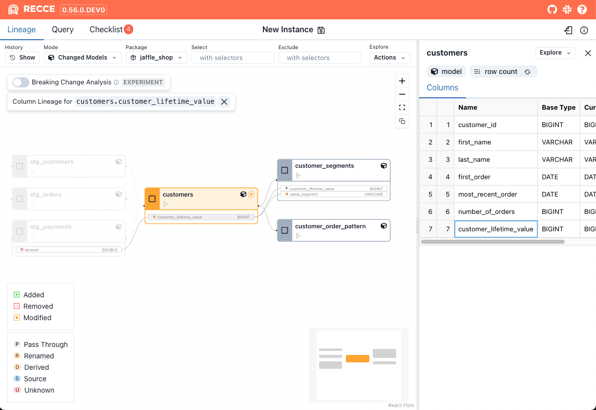

Column-Level Lineage provides visibility into the upstream and downstream relationships of a column. 

Common use-cases for column-level lineage are

1. **Source Exploration**: During development, column-level lineage helps you understand how a column is derived.
2. **Impact Analysis**: When modifying the logic of a column, column-level lineage enables you to assess the potential impact across the entire DAG.
3. **Root Cause Analysis**: Column-level lineage helps identify the possible source of errors by tracing data lineage at the column level.

## Usage

1. Select a node in thew lineage DAG, then click the **eye** icon next to the column you want to view.

    {: .shadow}

1. The column-level lineage for the selected column will be displayed.

    {: .shadow}

## Transformation Types

The transformation type is also displayed for each column, which will help in understanding how the column was generated or modified.

| Type | Description  |
|------|--------------|
| Pass-through  |The column is directly selected from the upstream table. |
| Renamed | The column is selected from the upstream table but with a different name. |
| Derived | The column is created through transformations applied to upstream columns, such as calculations, conditions, functions, or aggregations. |
| Source | The column is not derived from any upstream data. It may originate from a seed/source node, literal value, or data generation function. |
| Unknown | We have no information about the transformation type. This could be due to a parse error, or other unknown reason. | 

## Limitation

Column-level lineage only displays column selection operations. It does not indicate if a column has been used in filters (WHERE clauses), with grouping (GROUP BY), joins, or other transformations.