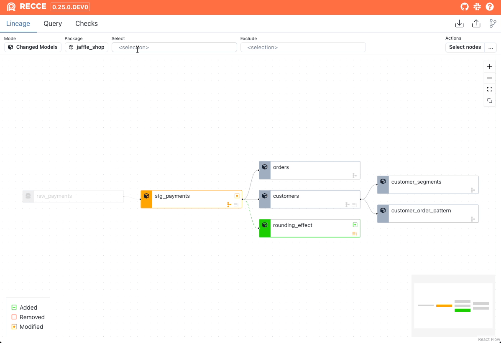
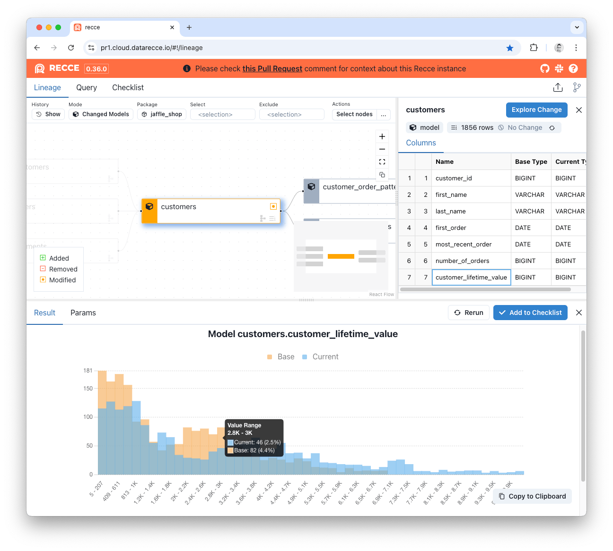
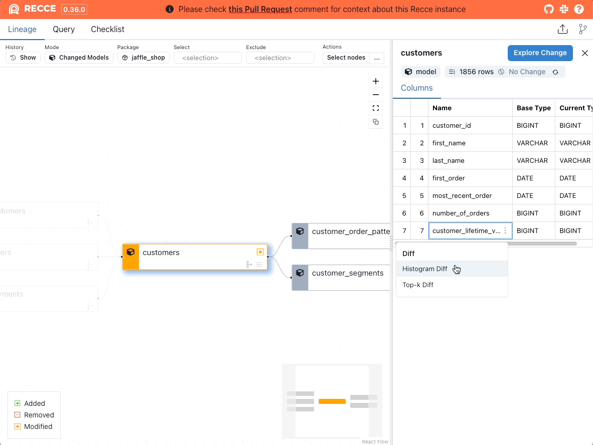
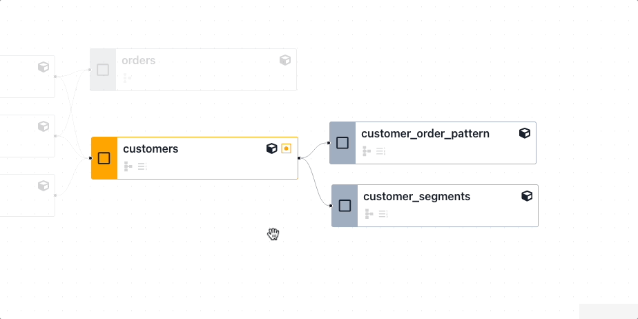
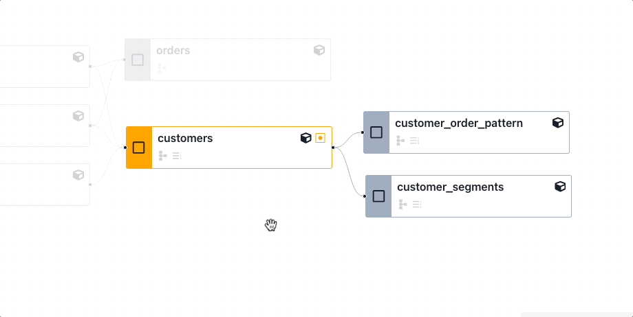
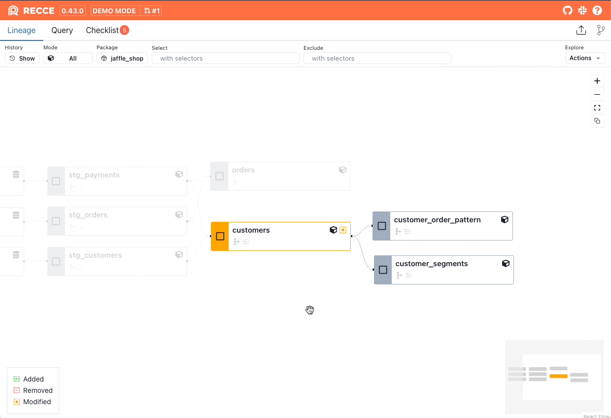

The Lineage Diff is the main interface to Recce and allows you to quickly see the potential area of impact from your dbt data modeling changes.

## Lineage Diff
It's from the Lineage Diff that you will determine which models to investigate further; and also perform the various data validation checks that will serve as proof-of-correctness of your work.


<figure markdown>
  {: .shadow}
  <figcaption>Lineage Diff</figcaption>
</figure>


### Node Summary
{: .shadow}

Models are color-coded to indicate their **status**:

- `Added` models are green.
- `Removed` models are red.
- `Modified` models are orange.

The two icons at the bottom right of each node indicate if a `row count` or `schema` change has been detected. Grayed out icons indicate no change.

<figure markdown>
  {: .shadow}
  <figcaption>Model with Schema Change detected</figcaption>
</figure>

**Note**: A row count changed icon is only shown if there is row count diff executed on this node.

<figure markdown>
  {: .shadow}
  <figcaption>Open the node details panel</figcaption>
</figure>

Click a model to open the [node details](#node-detail) panel and perform other data validation checks.

### Filter Nodes
In the top control bar, you can change the rule to filter the nodes:

1. **Mode:**
    - **Changed Models:** Modified nodes and their downstream + 1st degree of their parents.
    - **All:** Show all nodes.
1. **Package:** Filter by dbt package names.
1. **Select:** Select nodes by [node selection](./node-selection.md).
1. **Exclude:** Exclude nodes by [node selection](./node-selection.md).

### Select Nodes

Click a node to select it, or click the  **Select nodes** button at the top-right corner to select multiple nodes for further operations. For detail, see the [Multi Nodes Selections](#multi-nodes-selection) section 

### Row Count Diff

A row count diff can be performed on nodes selected using the `select` and `exclude` options:

{: .shadow}


After selecting nodes, run the row count diff by:

1. Clicking the 3 dots (**...**) button at the top-right corner.
2. Clicking **Row Count Diff by Selector**.


## Node Details

The node details panel shows information about a node, such as node type, schema and row count changes, and allows you to perform diffs on the node using the options accessed via the `Explore Change` button. 

### Schema Diff

Schema Diff shows added, removed, and renamed columns. Click a model in the Lineage Diff to open the node details and view the Schema Diff.

!!! Note
    Schema Diff requires `catalog.json` in both environments.


<figure markdown>
  {: .shadow}
  <figcaption>Schema Diff</figcaption>
</figure>


<figure markdown>
  
  <figcaption>Schema Diff showing renamed column</figcaption>
</figure>


### Row Count Diff

Row Count Diff shows the difference in row count between the base and current environments.

1. Click the model in the Lineage DAG.
2. Click the `Explore Change` button in the node details panel.
3. Click `Row Count Diff`.

<figure markdown>
  {: .shadow}
  <figcaption>Row Count Diff - Single model</figcaption>
</figure>

### Code Diff

Code Diff shows the model code that has changed for a particular model.


1. Click the model in the Lineage DAG.
2. Click the `Explore Change` button in the node details panel.
3. Click `Code Diff`.

### Value Diff

Value Diff shows the matched count and percentage for each column in the table. It uses the primary key(s) to uniquely identify the records between the model in both environments.

The primary key is automatically inferred by the first column with the [unique](https://docs.getdbt.com/reference/resource-properties/data-tests#unique) test. If no primary key is detected at least one column is required to be specified as the primary key.


<figure markdown>
  
  <figcaption>Value Diff</figcaption>
</figure>

- **Added**: Newly added PKs.
- **Removed**: Removed PKs.
- **Matched**: For a column, the count of matched value of common PKs.
- **Matched %**: For a column, the ratio of matched over common PKs.

!!! note

    Value Diff uses the `compare_column_values` from [audit-helper](https://hub.getdbt.com/dbt-labs/audit_helper/latest/). To use Value Diff, ensure that `audit-helper` is installed in your project.

    ```yaml
    packages:
      - package: dbt-labs/audit_helper
        version: <version>
    ```


View mismatched values at the row level by clicking the `show mismatched values` option on a column name:

{: .shadow}

### Profile Diff

Profile Diff compares the basic statistic (e.g. count, distinct count, min, max, average) for each column in models between two environments.

1. Select the model from the Lineage DAG.
2. Click the `Expore Change` button.
3. Click `Profile Diff`.


<figure markdown>
  
  <figcaption>Profile Diff</figcaption>
</figure>

Please refer to the [dbt-profiler](https://hub.getdbt.com/data-mie/dbt_profiler/latest/#dbt-profiler) documentation for the definitions of profiling stats.

!!! Note
    Profile diff uses the `get_profile` from [dbt-profiler](https://hub.getdbt.com/data-mie/dbt_profiler/latest/). To use Profile Diff, ensure that dbt-profiler is installed in your project.

    ```yaml
    packages:
      - package: data-mie/dbt_profiler
        version: <version>
    ```

### Histogram Diff

Histogram Diff compares the distribution of a numeric column in an overlay histogram chart.   

<figure markdown>
  
  <figcaption>Histogram Diff</figcaption>
</figure>

A Histogram Diff can be generated in two ways.

**Via the Explore Change button menu:**


1. Select the model from the Lineage DAG.
2. Click the `Explore Change` button.
3. Click `Histogram Diff`.
4. Select a column to diff.
5. Click `Execute`.

**Via the column options menu:**

1. Select the model from the Lineage DAG.
2. Hover over the column in the Node Details panel.
3. Click the vertical 3 dots `...`
4. Click `Histogram Diff`.


<figure markdown>
  {: .shadow}
  <figcaption>Generate a Recce Histogram Diff from the column options</figcaption>
</figure>


### Top-K Diff

Top-K Diff compares the distribution of a categorical column. The top 10 elements are shown by default, which can be expanded to the top 50 elements.

<figure markdown>
  
  <figcaption>Recce Top-K Diff</figcaption>
</figure>


A Top-K Diff can be generated in two ways.

**Via the Explore Change button menu:**


1. Select the model from the Lineage DAG.
2. Click the `Explore Change` button.
3. Click `Top-K Diff`.
4. Select a column to diff.
5. Click `Execute`.

**Via the column options menu:**

1. Select the model from the Lineage DAG.
2. Hover over the column in the Node Details panel.
3. Click the vertical 3 dots `...`
4. Click `Top-K Diff`.


<figure markdown>
  {: .shadow}
  <figcaption>Generate a Recce Top-K Diff </figcaption>
</figure>


## Multi-Node Selection

Multiple nodes can be selected in the Lineage DAG. This enables actions to be performed on multiple nodes at the same time such as Row Count Diff, or Value Diff.

### Select Nodes Individually

To select multiple nodes individually, click the check box on the nodes you wish to select.

<figure markdown>
  {: .shadow}
  <figcaption>Select multiple nodes individually</figcaption>
</figure>

### Select Parent or Child nodes

To select a node and all of its parents or children:

1. Click the checkbox on the node
2. Right click the node
3. Click to select either parent or child nodes

<figure markdown>
  {: .shadow}
  <figcaption>Select a node and its parents or children</figcaption>
</figure>

### Perform actions on multiple nodes

After selecting the desired nodes, use the Actions menu at the top right of the screen to perform diffs or add checks.

<figure markdown>
  {: .shadow}
  <figcaption>Perform actions on multiple nodes</figcaption>
</figure>

### Example - Row Count Diff

An example of selecting multiple nodes to perform a multi-node row count diff:

<figure markdown>
  {: .shadow}
  <figcaption>Perform a Row Count Diff on multiple nodes</figcaption>
</figure>

### Example - Value Diff

An example of selecting multiple nodes to perform a multi-node Value Diff:

<figure markdown>
  {: .shadow}
  <figcaption>Perform a Value Diff on multiple nodes</figcaption>
</figure>


## Screenshot

In the diff result, we can find a **Copy to Clipboard** button. it's a handy feature to copy the result image to clipboard and paste in your PR comment.

<figure markdown>
  {: .shadow}
  <figcaption>Copy a diff result screenshot to the clipboard and paste to GitHub</figcaption>
</figure>

!!! Note

    FireFox does not support to copy image to clipboard. Recce show a modal instead. You can download the image to local or right-click on the image to copy the image.

## Add to Checklist

In the lineage page, we can run different type of check. However, for these reason we would like to add to checklist

1. Keep the check and I can rerun this after my code change
2. Add my result and interpretation for review purpose

### Lineage Diff

**Lineage diff by selector**

1. Select nodes by `Select` and `Exclude` on the top control.
1. Click **...** at the top-right corner
1. Click the **Lineage diff**

**Lineage diff by multi nodes selection**

1. Click **Select nodes** button at the top-right corner
1. Select nodes
1. Click the **Add lineage diff check** button


### Schema Diff

**Schema diff by node selector**

1. Select nodes by `Select` and `Exclude` on the top control.
1. Click **...** at the top-right corner
1. Click the **Schema diff** button


**Schema diff by multi nodes selection**

1. Click **Select nodes** button at the top-right corner
1. Select nodes
1. Click the **Add schema check** button

**Schema diff for single node**

1. Select a node, then the node detail would show.
2. Click **Add check** button on the node detail pane.
3. Click **Schema check**

### Row Count Diff

**Row count diff by node selector**

1. Select nodes by `Select` and `Exclude` on the top control.
1. Click **...** at the top-right corner
1. Click the **Row Count Diff by Selctor**, then it will run the row count diff
1. Click the **Add to checklist** in the result page.

**Row count diff by multi nodes selection**

1. Click **Select nodes** button
1. Select nodes
1. Click **Row count diff**, then it will run the row count diff
1. Select a node, then the run result would show.
1. Click **Add to checklist**

### Other Diffs

1. Execute the diff    
1. Click **Add to checklist**
