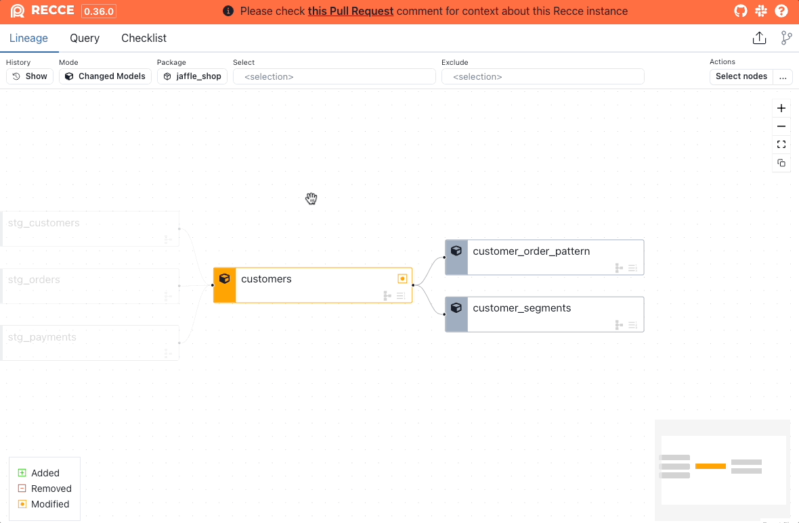
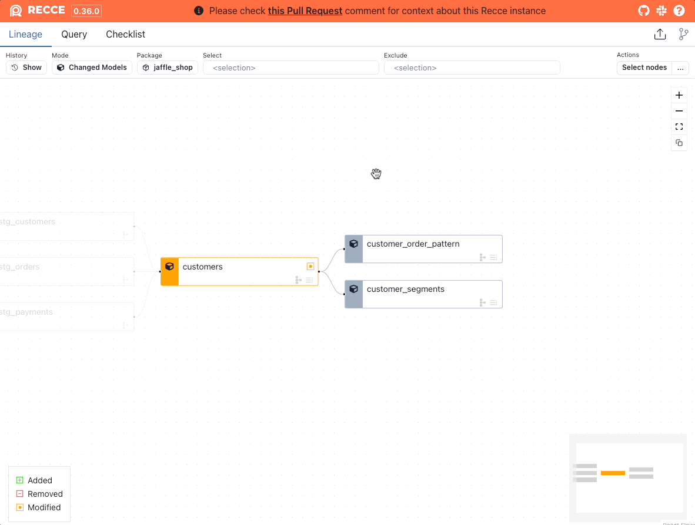

Lineage page the main interface to Recce and how you can quickly determine the zone of impact of any modeling changes.

## Lineage Diff
It's from Lineage Diff that you will determine which models to investigate further to validate your changes.


<figure markdown>
  {: .shadow}
  <figcaption>Lineage Diff</figcaption>
</figure>


### Node Summary
{: .shadow}

- Models are color coded to indicate `added`, `removed`, and `modified` models.
- The bottom icon indicates if there is `row count changed` or `schema changed` detected. A row count changed icon is only shown if there is row count diff executed on this node.
- Click a model to view the [Node detail](#node-detail) and perform other checks. 

### Filter Nodes
In the top control bar, you can change the rule ot filter the nodes

1. **View Mode:**
    - **Changed Models:** Modified nodes and their downstream + 1st degree of their parents.
    - **All:** Show all nodes.
1. **Package:** Filter by dbt package names.
1. **Select:** Select nodes by [node selection](./node-selection.md)
1. **Exclude:** Exclude nodes by [node selection](./node-selection.md)

### Select Nodes

By clicking the **Select nodes** button at the top-right corner, you can select multiple nodes for further operations. For detail, see the [Multi Nodes Selections](#multi-nodes-selection) section 

### Row Count Diff

{: .shadow}

You can run the row count diff on the selected node (selected by `select` and `exclude`)

To run the row count diff by selector

1. Click the **...** button at the top-right corner.
2. Click on **Row Count Diff by Selector**.


## Node Detail


### Schema Diff

!!! Note
    Schema Diff requires `catalog.json` in both environments.

Schema Diff shows added, removed, and renamed columns. Click a model in the Lineage DAG Diff to view the Schema Diff.

<figure markdown>
  {: .shadow}
  <figcaption>Schema Diff</figcaption>
</figure>


<figure markdown>
  
  <figcaption>Schema Diff showing renamed column</figcaption>
</figure>


### Row Count Diff

Row Count Diff shows the difference in row count between the base and current environments. 

<figure markdown>
  {: .shadow}
  <figcaption>Row Count Diff - Single model</figcaption>
</figure>

### Code Diff


1. Select the model from the Lineage DAG.
1. Click the **Diff** button on the upper right corner.

### Value Diff

!!! note

    Value Diff uses the `compare_column_values` from [audit-helper](https://hub.getdbt.com/dbt-labs/audit_helper/latest/). To use Value Diff, ensure that `audit-helper` is installed in your project.

    ```yaml
    packages:
      - package: dbt-labs/audit_helper
        version: <version>
    ```

Value Diff shows the matched count and percentage for each columns in the table. It use the primary key(s) to uniquely identify the records between the model in both environments.

The primary key is automatically inferenced by the first column with the [unique](https://docs.getdbt.com/reference/resource-properties/data-tests#unique) test. If no primary key is detected, at least one column required to be specified as primary key.


<figure markdown>
  
  <figcaption>Value Diff</figcaption>
</figure>

- **Added**: Newly added PKs.
- **Removed**: Removed PKs.
- **Matched**: For a column, the count of matched value of common PKs.
- **Matched %**: For a column, the ratio of matched over common PKs.


You can query all the diff records from the value diff result.

{: .showdow}

### Profile Diff

!!! Note
    Profile diff uses the `get_profile` from [dbt-profiler](https://hub.getdbt.com/data-mie/dbt_profiler/latest/). To use Profile Diff, ensure that dbt-profiler is installed in your project.

    ```yaml
    packages:
      - package: data-mie/dbt_profiler
        version: <version>
    ```

Profile Diff compare the basic statistic (e.g. count, distinct count, min, max, average) for each columns between two environments.

1. Select the model from the Lineage DAG.
1. Click the **Advanced Diffs** button


<figure markdown>
  
  <figcaption>Profile Diff</figcaption>
</figure>

Please reference [dbt-profiler](https://hub.getdbt.com/data-mie/dbt_profiler/latest/#dbt-profiler) for the definition of the profiling stats.

### Histogram Diff

Histogram Diff compares the distribution of a numeric column in an overlay histogram chart.   

<figure markdown>
  {: .shadow}
  <figcaption>Histogram Diff</figcaption>
</figure>


1. Select the model from the Lineage DAG.
2. Click the `Advanced Diffs` buton and select `Histogram Diff`.
3. Select the column to diff and click `Execute`.


<figure markdown>
  {: .shadow}
  <figcaption>Generate a Recce Histogram Diff </figcaption>
</figure>


### Top-K Diff

Top-K Diff compares the distribution of a categorical column. The top 10 elements are shown by default. This can be expanded to the the top 50 elements.

<figure markdown>
  
  <figcaption>Recce Top-K Diff</figcaption>
</figure>


1. Select the model from the Lineage DAG.
2. Click the `Advanced Diffs` buton and select `Top-K Diff`.
3. Select the column to diff and click `Execute`.


<figure markdown>
  {: .shadow}
  <figcaption>Generate a Recce Top-K Diff </figcaption>
</figure>


## Multi Nodes Selection

### Select Nodes
1. Click the **Select nodes** button
2. Select one or more nodes
3. or right click on a nodes, you can **Select parent nodes** or **Select child nodes**
4. Click the action in the multi select control bar.

### Row Count Diff
Row Count Diff shows the difference in row count between the base and current environments. 

<figure markdown>
  {: .shadow}
  <figcaption>Row Count Diff - Multiple model</figcaption>
</figure>

### Value Diff

{: .shadow}


## Screenshot

In the diff result, we can find a **Copy to Clipboard** button. it's a handy feature to copy the result image to clipboard and paste in your PR comment.

!!! Note

    FireFox does not support to copy image to clipboard. Recce show a modal instead. You can download the image to local or right-click on the image to copy the image.

## Add to Checklist

In the lineage page, we can run different type of check. However, for these reason we would like to add to checklist

1. Keep the check and I can rerun this after my code change
2. Add my result and interpretation for review purpose

### Lineage Diff

**Lineage diff by selector**

1. Select nodes by `Select` and `Exclude` on the top control.
1. Click **...** at the top-right corner
1. Click the **Lineage diff**

**Lineage diff by multi nodes selection**

1. Click **Select nodes** button at the top-right corner
1. Select nodes
1. Click the **Add lineage diff check** button


### Schema Diff

**Schema diff by node selector**

1. Select nodes by `Select` and `Exclude` on the top control.
1. Click **...** at the top-right corner
1. Click the **Schema diff** button


**Schema diff by multi nodes selection**

1. Click **Select nodes** button at the top-right corner
1. Select nodes
1. Click the **Add schema check** button

**Schema diff for single node**

1. Select a node, then the node detail would show.
2. Click **Add check** button on the node detail pane.
3. Click **Schema check**

### Row Count Diff

**Row count diff by node selector**

1. Select nodes by `Select` and `Exclude` on the top control.
1. Click **...** at the top-right corner
1. Click the **Row Count Diff by Selctor**, then it will run the row count diff
1. Click the **Add to checklist** in the result page.

**Row count diff by multi nodes selection**

1. Click **Select nodes** button
1. Select nodes
1. Click **Row count diff**, then it will run the row count diff
1. Select a node, then the run result would show.
1. Click **Add to checklist**

### Other Diffs

1. Execute the diff    
1. Click **Add to checklist**
