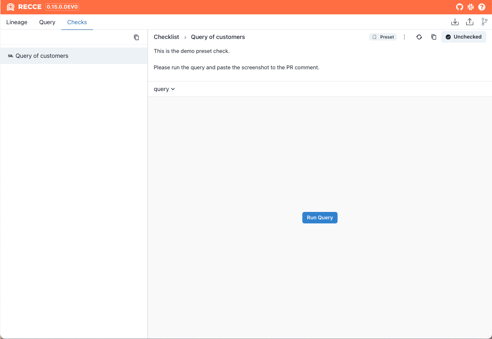

In a dbt project, there may be some checks that need to be conducted for every PR. For example, this could be an SQL query, or checking whether an important model has had a schema change.

Preset checks can be the fixed checks that are generated every time a new recce server is initiated.


## Configure the Preset Check


1. Add a check to your checklist
    {: .shadow}
2. Open the menu for the check and select **Get Preset Check Template**.
3. Copy the yaml config from the dialog
    {: .shadow}

4. Paste the config into the `recce.yml` file located at the root of the project:


    ```yaml
    # recce.yml
    checks:
      - name: Query diff of customers
        description: |
          This is the demo preset check.
    
          Please run the query and paste the screenshot to the PR comment.
        type: query_diff
        params:
          sql_template: select * from {{ ref("customers") }}
        view_options:
          primary_keys:
            - customer_id
    ```

## Create the Preset Checks

### Recce Server

1. When a new recce server is launched, all preset checks are automatically set up, but these checks are not executed at this time.
    {: .shadow}
2. When the **Run Query** button is pressed, the check will be executed.

### Recce Run

1. Running `recce run` executes all preset checks. The default output file is recce_state.json.
    ```
    $ recce run
    ───────────────────────────────── DBT Artifacts ─────────────────────────────────
    Base:
        Manifest: 2024-04-10 08:54:41.546402+00:00
        Catalog:  2024-04-10 08:54:42.251611+00:00
    Current:
        Manifest: 2024-04-22 03:24:11.262489+00:00
        Catalog:  2024-04-10 06:15:13.813125+00:00
    ──────────────────────────────── Default queries ────────────────────────────────
    Querying row count diff for the modified table models. [1 node(s)]
    Completed in 0.06 seconds
    ───────────────────────────────── Preset checks ─────────────────────────────────
                                Recce Preset Checks
    ──────────────────────────────────────────────────────────────────────────────
    Status      Name                 Type         Execution Time   Failed Reason
    ──────────────────────────────────────────────────────────────────────────────
    [Success]   Query of customers   Query Diff   0.10 seconds     N/A
    ──────────────────────────────────────────────────────────────────────────────
    The state file is stored at [recce_state.json]
    ```
2. You can view the check results by launching the recce server.

    ```shell
    recce server recce_state.json
    ```

    