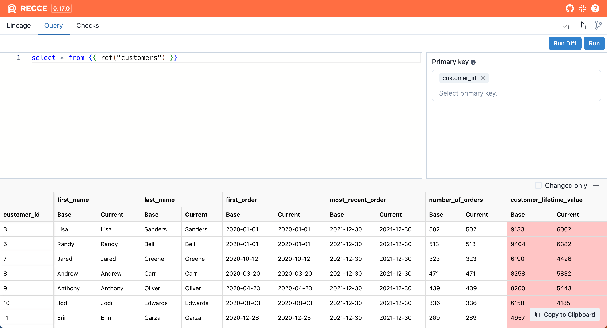

# Query Diff

Query Diff performs the same query in both environments and diffs the results. 

You can use any dbt macros that are installed in your project.

```
select * from {{ ref("mymodel") }}
```

<figure markdown>
  
  <figcaption>Query Diff</figcaption>
</figure>

After performing a query, select the primary key by clicking the `key` icon.

<figure markdown>
  
  <figcaption>Query Diff</figcaption>
</figure>


Query Diff performs the diff client-side so, for large datasets, it's advisable to minimize the data queried to improve performance.