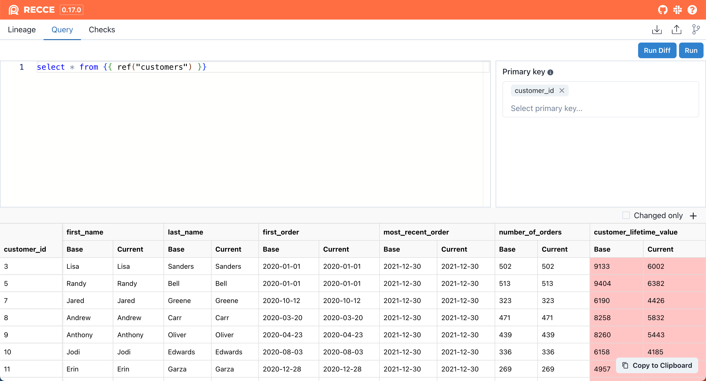

Query page provides an AdHoc query interface to run arbitrary query or diff the query result between two environments. You can use any dbt macros that are installed in your project.

## Execute Query

```
select * from {{ ref("mymodel") }}
```

1. **Run:** performs query in the current environment
2. **Run Diff:** performs the same query in both environments and diffs the results. 

  

!!! tip

    In Mac, you can use `⌘ Enter` to run a query or use `⌘ ⇧ Enter` to run a query diff.

## Query Result

{: .shadow}


- **Primary Key:** select the primary key by clicking the `key` icon. The primary key columns are used to be identified as the same record for both sides. If no primary key is specified, the records is compared by the row's index.
- **Pinned Column:** The pinned column would show first in the column list.
- **Changed Only:**: By selecting the **Changed only**, we can show only the changed rows and columns. The pinned columns are always shown even they are not changed.

## Shortcut to query a model
1. In the lineage page, select a model
2. Click the **Query** button
3. Then the query page is shown and filled with the query for this model

## Add to Checklist

Click the `+` button in the result pane, then you can add the query result to the checklist.

## How Query Diff Works
In the current version, AdDoc query compare the query result for the both environment in the client side. That is, Recce fetches the first 2,000 rows and compare in the client side. The advantage is that we don't need to provide primary upfront, and it also flexible to query sql for no PK. However, the limitation is that we cannot find the mismatched rows in a big query result.

In the near future, we will implement a feature that diff the query with primary key specified. And it only shows the diff rows. Stay tuned 😎