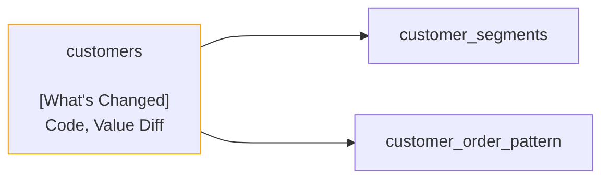

# Recce Summary

## Lineage Graph

## Checks Summary

| Total Checks | Impacted Checks |
| ------------ | --------------- |
| 5            | 2               |

## Impacted Checks

| Name                                       | Type       | Description                                                     |
| ------------------------------------------ | ---------- | --------------------------------------------------------------- |
| Value diff of customers                    | Value Diff | The customer_lifetime_value in customers should be 100% matched |
| Query diff of customers avg lifetime value | Query Diff | The average of customer_lifetime_value should not be changed    |
