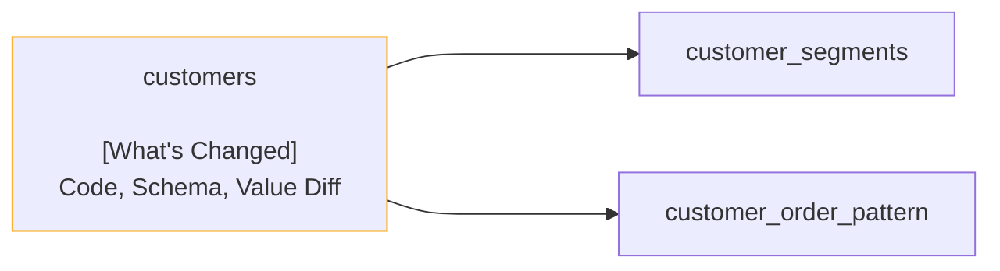

# Recce Summary

## Lineage Graph

## Checks Summary

| Total Checks | Data Mismatch Detected |
| ------------ | ---------------------- |
| 5            | 3                      |

### Checks of Data Mismatch Detected

| Name                                       | Type        | Related Models |
| ------------------------------------------ | ----------- | -------------- |
| Model schema of customers                  | Schema Diff | customers      |
| Value diff of customers                    | Value Diff  | customers      |
| Query diff of customers avg lifetime value | Query Diff  | N/A            |
