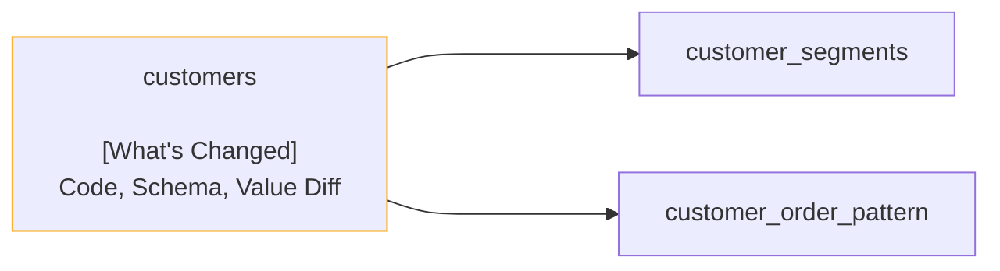

Recce `Summary` command is used to generate a summary based on the input state file. In the previous section, the `Run` command was used to generate a state file based on the two environments. It provides a way to integrate Recce into your CI/CD pipeline. The `Summary` command is used to generate a summary based on the output of `Run` command. You can also integrate the `Summary` command into your CI/CD pipeline to generate a summary based on the state file generated by the `Run` command. Therefor, the generated summary can be posted to your repository hosting platform, such as GitHub, GitLab, or Bitbucket.

## Usage

```bash
recce summary <Path-of-recce-state-file>
```

## Example

```bash
recce summary recce-state.json
```

## Output

The output of the `summary` command will be markdown format. The markdown output will contain the following sections:

- Lineage Graph - A graph that shows the lineage of the models that are impacted by the modified models.
- Checks Summary - A summary of the checks that are detected mismatch between `base` and `current` environments.

### Example Output

````markdown
# Recce Summary

## Lineage Graph



## Checks Summary

| Total Checks | Data Mismatch Detected |
| ------------ | ---------------------- |
| 5            | 3                      |

### Checks of Data Mismatch Detected

| Name                                       | Type        | Related Models |
| ------------------------------------------ | ----------- | -------------- |
| Model schema of customers                  | Schema Diff | customers      |
| Value diff of customers                    | Value Diff  | customers      |
| Query diff of customers avg lifetime value | Query Diff  | N/A            |
````

The rendered output will look like this. [Example Output](./recce-summary-example.md)

## Content of the Summary

### Lineage Graph

The lineage graph shows the lineage of the models that are impacted by the modified models. The graph is generated using the `mermaid` library. The graph is a directed graph that shows the relationship between the models. The graph is generated based on the modified models and their's children models.
If the model is modified or impacted by the modified model, it will be highlighted in the `[What's Changed]` section.

#### Example of Lineage Graph


### Checks Summary

Shows the total number of checks and the number of data mismatched checks. The table will contain the following columns:

- Total Checks - The total number of checks.
- Data Mismatch Detected - The number of checks which data mismatched between `base` and `current` environments.

### Checks of Data Mismatch Detected

Shows the checks that are detected data mismatch between `base` and `current` environments.
If the check is detected data mismatch, we will suggest the PR reviewer should take a look at the check and investigate the data mismatch is expected or not.
The table will contain the following columns:

- Name - The name of the check.
- Type - The type of the check.
- Related Models - The models that are related to the check. If a check is not related to any models, it will be `N/A`.

If all the check between `base` and `current` environments are matched, the `Checks of Data Mismatch Detected` section will not be shown.

#### Example of Data Mismatch Detected

| Name                                       | Type        | Related Models |
| ------------------------------------------ | ----------- | -------------- |
| Model schema of customers                  | Schema Diff | customers      |
| Value diff of customers                    | Value Diff  | customers      |
| Query diff of customers avg lifetime value | Query Diff  | N/A            |

## How to Integrate with CI/CD Pipeline

The generated summary can be posted to any kinds of repository hosting platform, such as GitHub, GitLab, or Bitbucket.
Please refer to the [Recce CI integration with GitHub Action](../guides/scenario-ci.md) section for more information on how to integrate Recce with your CI/CD pipeline.
