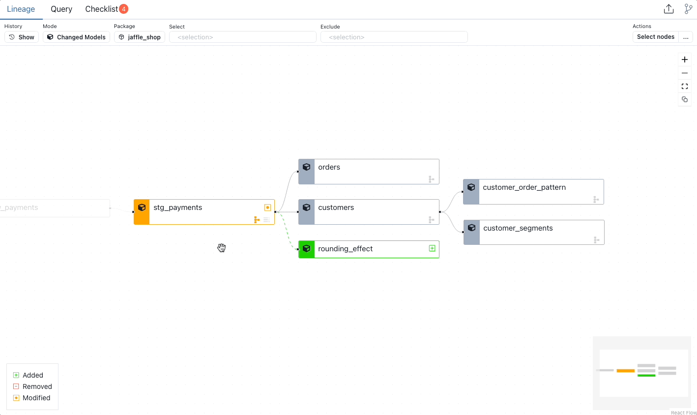

# Schema Diff

Schema Diff shows added, removed, and renamed columns. Click a model in the Lineage DAG Diff to view the Schema Diff.

<figure markdown>
  
  <figcaption>Schema Diff</figcaption>
</figure>

<figure markdown>
  
  <figcaption>Schema Diff showing renamed column</figcaption>
</figure>

