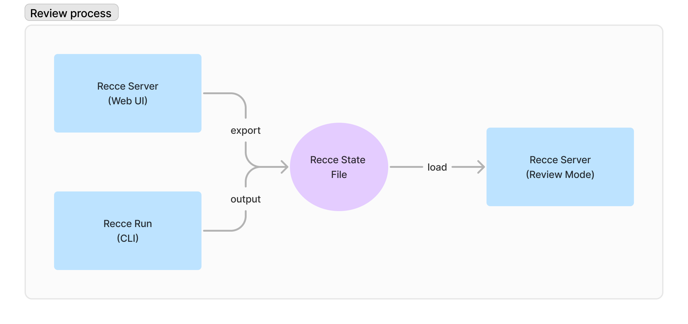

## Introduction
The state file is the serialized state of a recce instance. There are two scenarios where we need to export the state file:

- [PR Review](#pr-review): We can include the state file in the PR Review Comment. If the reviewer wants to further connect to the PR environment, they can use this file to see the final results and perform deeper audits.
- [Development](#development): During development, we often need to save the state and even switch between different branches for development.


## PR Review
In the PR review process, the state file can serve as a medium of communication between the submitter and the reviewer.



### Create a State File for Review

- **Export from Web UI**: To export the current Recce state, you can use the **Export** button located in the top right corner of the Web UI to export the state to a file.

- **Output of the Recce Run**: 
A more mature dbt project may have a CI/CD process in place where dbt transformations are run, and the results are placed in a PR-specific environment. In such cases, you can integrate [recce run](./recce-run.md) in your automation workflow, making it convenient for reviewers to audit the results to determine whether the merge can proceed.


### What's in the State File

- **Checks**: These are the data from the checks that have been added to the checklist on the Checks page.
- **Runs**: Each execution in Recce represents a run, analogous to a query in the warehouse. However, typically, a single run may submit series of queries in the warehouse and get the final run result.
- **Environments' Artifacts**: The base and current environments' `manifest.json` and `catalog.json`.
- **Runtime Information**: Such as git branch information, PR information in the CI runner.

### Review the State File

To review a PR, you can download the corresponding state file and open the file with additional `--review` option.

```
recce server --review recce_state.json
```

In this mode, the Recce server won't use the dbt artifacts inside `target` and `target-base`. Instead, it will use the artifacts from the Recce state file.

## Development


When running the Recce server, you can specify an additional file argument

```
recce server recce_issue_1.json
```

If this file exists, Recce will use it as the initial state. If it doesn't exist, Recce will create a new one. When the server is terminated, the final state will be written into this file.


## Recce Cloud

!!! Note

    
    Currently, Recce Cloud is still under development. If you are interested, please [sign up for a Recce Cloud invite](https://datarecce.io/) or contact us in the [dbt slack #tool-recce channel](https://getdbt.slack.com/archives/C05C28V7CPP)


Although a state file can store the state, it is not very suitable for recording the latest review status of a PR. Especially since a PR may include the submitter, reviewer, and the automated processes in the CI workflow. The purpose of Recce Cloud is to solve the PR review status management issue.

***Prerequisites***

Before uploading the state file to Recce Cloud, you need to define a password to encrypt the state file. The password is used to encrypt the state file before uploading it to Recce Cloud. It will also be used to decrypt the state file when you download it from Recce Cloud. The password is not stored in Recce Cloud, so you need to keep it safe.

### PR Review Workflow
This is a most common workflow: the submitter pushes commits to the GitHub PR, and the reviewer is responsible for reviewing/auditing the PR. This includes checking code changes, ensuring requirements are met, and assessing whether there is any impact on existing models.

**As a submitter**

1. Push changes to the remote
1. Create PR for review
1. Run dbt to prepare the PR review environment
    ```
    dbt run
    ```
1. Launch recce server for this PR branch
    ```
    recce server --cloud --password <password-to-encrypt-state-file>
    ```
1. Add recce checks for review
1. Leave description and screenshots in the PR comments

**As a reviewer**

1. Checkout the PR branch
1. Launch recce server for this PR branch in the review mode
   ```
   recce server --review --cloud --password <password-to-encrypt-state-file>
   ```
1. If all checks are good, mark all checks as **Checked**. Otherwise, leave comment in the PR comment or the recce check description.

### PR Review Workflow with CI

For more mature projects, we introduce CI automation to standardize the process and reduce human-caused variability or errors. 
In the workflow, we will do the following two things in the CI:

Execute dbt to create a PR environment.
Execute recce to update dbt artifacts, rerun check runs, and update the PR status to Recce Cloud.


**As a submitter**

1. Push changes to the remote
1. Create PR for review

**In the CI workflow of the PR push event**

1. The github action worflow is triggered by the push event
1. Checkout the PR branch
1. Fetch the dbt artifacts for the base environment
1. Run dbt for the PR environment
    ```
    dbt run
    ```
1. Run recce for the current PR and upload state to the recce cloud.
    ```
    recce run --cloud --password <password-to-encrypt-state-file>
    ```

**As a submitter and reviewer, collaborate the state in the review mode recce server**

1. Checkout the PR branch
1. Launch recce server for this PR branch in the review mode
   ```
   recce server --review --cloud --password <password-to-encrypt-state-file>
   ```
