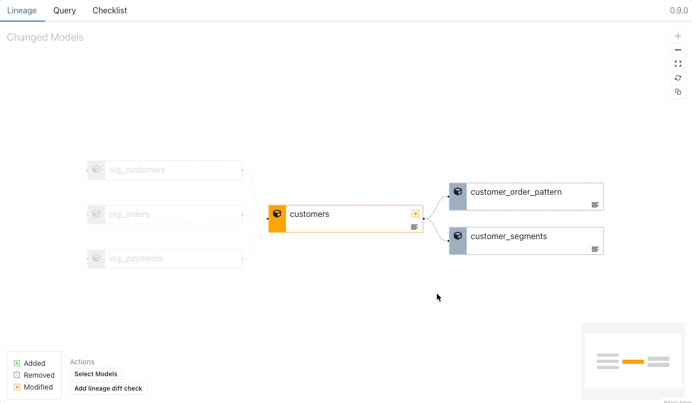

# Top-K Diff

Top-K Diff shows a ranked comparison of top-k elements from each model. The top 10 elements are shown by default. This can be expanded to the the top 50 elemements.

<figure markdown>
  
  <figcaption>Recce Top-K Diff</figcaption>
</figure>

1. Select the model from the Lineage DAG.
2. Click the `Advanced Diffs` buton and select `Top-K Diff`.
3. Select the column to diff and click `Execute`.

<figure markdown>
  
  <figcaption>Generate a Recce Top-K Diff </figcaption>
</figure>

