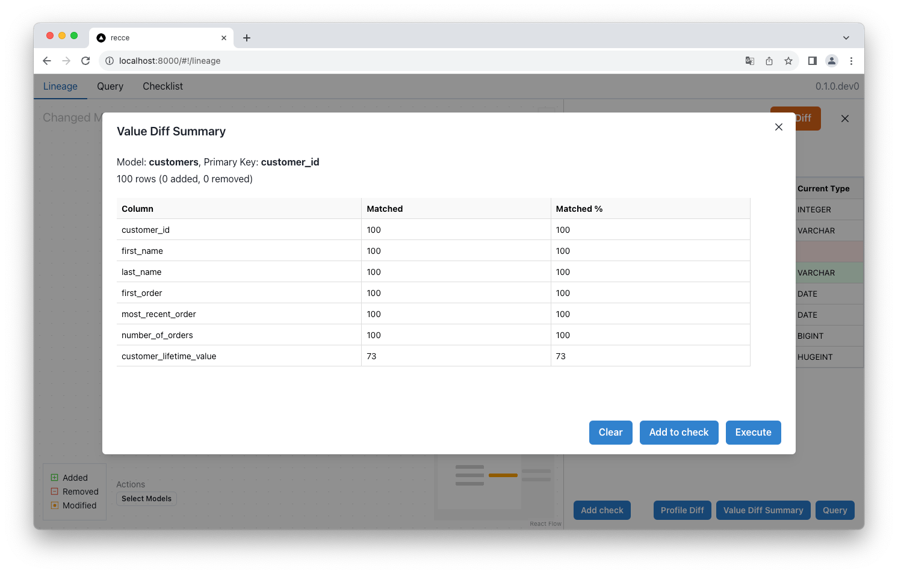

# Value Diff

<figure markdown>
  
  <figcaption>Value Diff</figcaption>
</figure>

- **Added**: Newly added PKs.
- **Removed**: Removed PKs.
- **Matched**: For a column, the count of matched value of common PKs.
- **Matched %**: For a column, the ratio of matched over common PKs.

PK: Primary key

Value Diff uses the `compare_column_values` from [audit-helper](https://hub.getdbt.com/dbt-labs/audit_helper/latest/). To use Value Diff, ensure that `audit-helper` is installed in your project.

```yaml
packages:
  - package: dbt-labs/audit_helper
    version: <version>
```

Value Diff requires you to to select a column as private key. A dbt `catalog.json` is required to list the available columns.