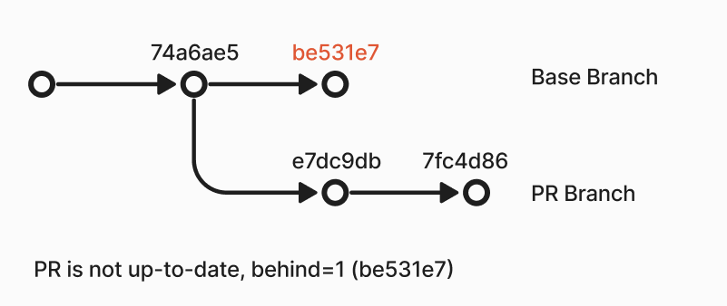

Recce is designed to compare two environments in your data project. To use it effectively, it is crucial to prepare environments through CI.

However, there are many challenges in preparing environments.

1. Your **source data** might be continuously updating.
2. Your transformations might be **time-consuming**.
3. The base branch may have **other PRs merged** at any time.
4. The generated environment will leave data in the warehouse, which also needs to be properly managed.

This article will not focus on how to use Recce but rather on how to effectively prepare environments for Recce use.


## Best Practices

### Use schema to manage your environments

In dbt, you can leverage profiles and targets to specify the credentials for your database connections. By using profiles and dynamically setting the schema, you can direct the transformation results to different schemas, effectively creating separate environments. Here's how you can achieve this using `env_var` or `arg` to dynamically change the schema:

1. **Define Your Profile and Target**:
Your `profiles.yml` should have different targets that you can switch between. Here’s an example of a `profiles.yml` file:
    
    ```yaml
    my_profile:
      target: dev
      outputs:
        dev:
          type: postgres
          host: localhost
          user: db_user
          password: db_pass
          port: 5432
          dbname: my_db
          schema: "{{ env_var('DBT_SCHEMA') }}"
        prod:
          type: postgres
          host: prod_host
          user: prod_user
          password: prod_pass
          port: 5432
          dbname: prod_db
          schema: public
    
    ```
    
2. **Run dbt with the Specified Schema**:
Now, when you run dbt commands, the `schema` setting will dynamically use the value of the `DBT_SCHEMA` environment variable.
    
    ```bash
    DBT_SCHEMA=pr_env dbt run
    
    ```
    
3. **Using `args` in dbt**:
You can also pass arguments directly in your dbt commands to dynamically set variables. For example:
    
    ```bash
    dbt run --vars '{"schema_name": "pr_123"}'
    
    ```
    
    And modify your `profiles.yml` to use this variable:
    
    ```yaml
    my_profile:
      target: dev
      outputs:
        dev:
          type: postgres
          host: localhost
          user: db_user
          password: db_pass
          port: 5432
          dbname: my_db
          schema: "{{ var('schema_name') }}"
    
    ```
    

This approach allows you to dynamically create different environments by changing the schema on-the-fly. This is particularly useful for creating isolated environments for different PRs or testing scenarios, ensuring that your transformations are scoped to the correct schema and avoiding conflicts between different environments.

### Prepare single base environment for all PRs to compare

Using the production environment as the base environment is a straightforward choice. However, to make Recce more efficient, using the staging environment might be more suitable.

This staging environment can have the following characteristics:

1. Ensure that the transformed results reflect the **latest commit** of the base branch.
2. Use the **same source data** as the PR environment.
3. Use the **same transformation logic** as the PR environment.

The basic principle is that the staging environment's configuration should be **as close as possible to the PR environments**, except for using a different git commit.

### Prepare per-PR environment

A moderately sized data project may have multiple branches in development simultaneously. To avoid interference, it is recommended that each PR have its own isolated PR environment. The schema name can be `pr_<number>`


### Reduce the update frequency of the source data used by both the base and PR environments

Some data projects may have source data that updates every hour or even every second. This can result in different transformation outcomes due to varying source data at different times, leading to Recce comparison results lacking discernibility.

Currently, some data warehouses support **zero-copy clone** (snowflake, bigquery, databricks), which allows us to freeze the source data at a specific point in time. Considering updating the source data weekly can significantly reduce the variability in environments caused by source data changes.

{: .shadow}

### Limit the data range used in transformations

Most data is temporal. When preparing the base and PR environments, we can use only the data from the last month. This can greatly reduce the data volume while still verifying correctness.

If zero-copy clone for the source data is not supported and the source data continues to update, you can consider excluding the current week's data. This approach can ensure that transformations yield consistent results regardless of when they are executed.

For example, you can design the transformation to only use data from the last month, up to Sunday at 00:00. This approach combines the benefits of shorter execution times and reduced data volatility.


```sql
SELECT
    *
FROM
    {{ source('your_source_name', 'orders') }}

WHERE
    order_date >= DATEADD(month, -1, CURRENT_DATE)
    AND order_date < DATE_TRUNC('week', CURRENT_DATE)

```
### **Ensure that the base environment is always up-to-date**

There are two scenarios that may cause the base environment to be out of date:

1. **New Source Data Changes**: If you update your data weekly, ensure that your base environment is updated at least once a week as well.
2. **New PRs Merged into base branch**: You can trigger a base environment update on merge events to ensure it remains current.

### Ensure the PR branch is in sync with the base branch

If the PR is executed after the base branch has been updated, the comparison with the base environment will mix the changes from the PR with the changes from other PRs merged into the base branch. This results in comparison outcomes that do not accurately reflect the impact of the current PR.

{: .shadow}

GitHub can automatically detect whether a PR is in sync. You need to [enable this feature](https://docs.github.com/en/pull-requests/collaborating-with-pull-requests/proposing-changes-to-your-work-with-pull-requests/keeping-your-pull-request-in-sync-with-the-base-branch) in the repository settings. Once enabled, you will see whether the PR is up-to-date directly on the PR page.

{: .shadow}

You can also to check if the PR is up-to-date in the CI workflow before preparing the PR environment. Here is an example in github action
```yaml
- name: Check if PR is up-to-date
  if: github.event_name == 'pull_request'
  run: |
    git fetch origin main
    UPSTREAM=${GITHUB_BASE_REF:-'main'}
    HEAD=${GITHUB_HEAD_REF:-${GITHUB_REF#refs/heads/}}
    if [ "$(git rev-list --left-only --count ${HEAD}...origin/${UPSTREAM})" -eq 0 ]; then
      echo "Branch is up-to-date"
    else
      echo "Branch is not up-to-date"
      exit 1
    fi
```

### Consider how to obtain your artifacts for environments

Recce relies on the base and current environment artifacts to find the corresponding tables in the data warehouse for comparison. So, the question is how to obtain the artifacts of the environments to be compared.

Here are a few methods you can choose:

1. In CI, upload the generated artifact to the cloud storage (e.g., AWS S3).
2. For dbt Cloud users, you can [download artifacts](https://docs.getdbt.com/dbt-cloud/api-v2#/operations/Retrieve%20Run%20Artifact) for the latest run of a given job.
3. For GitHub Actions users, you can use the GitHub CLI (gh) to [download artifacts](https://cli.github.com/manual/gh_run_download) for the latest run of a given workflow.

If the methods mentioned above are too complex, a stateless approach is to directly check out the base branch and run **`dbt docs generate`** to generate the artifacts.

### **Cleaning up PR environments on PR closed**

As the number of PRs in a project increases, automatically generated environments also grow. To manage this, you can create a workflow that listens for PR close events and performs cleanup actions. Additionally, you can schedule periodic cleanups to remove outdated environments, such as those not used for a week.

In dbt, you can use the **`dbt run-operation`** command to clear a specific schema corresponding to an environment. This can be especially useful for environments named in a pattern such as **`pr_{env}`**.

Here’s how you can define a macro to clear an environment schema:

```jinja





```

Run the macro

```shell
dbt run-operation clear_schema --args "{'schema_name': 'pr_123'}"
```

## Example

| Environments | Schema Name   | When to run        | # of environments   | Data range                       |
|--------------|---------------|--------------------|---------------------|----------------------------------|
| Production   | `public`      | Daily              | 1                   | All                              |
| Staging      | `staging`     | Daily + On Merge   | 1                   | 1 month, excluding this week     |
| PR           | `pr_<number>` | On Push            | # of opened PR      | 1 month, excluding this week     |


- Automate environment generation using GitHub Actions.
- PR Environment will only be generated automatically when the PR is up-to-date.
- Artifacts will be stored under the workflow’s artifacts.
- PR environments are removed on PR closed.
- Use staging environment as the base environment for Recce.