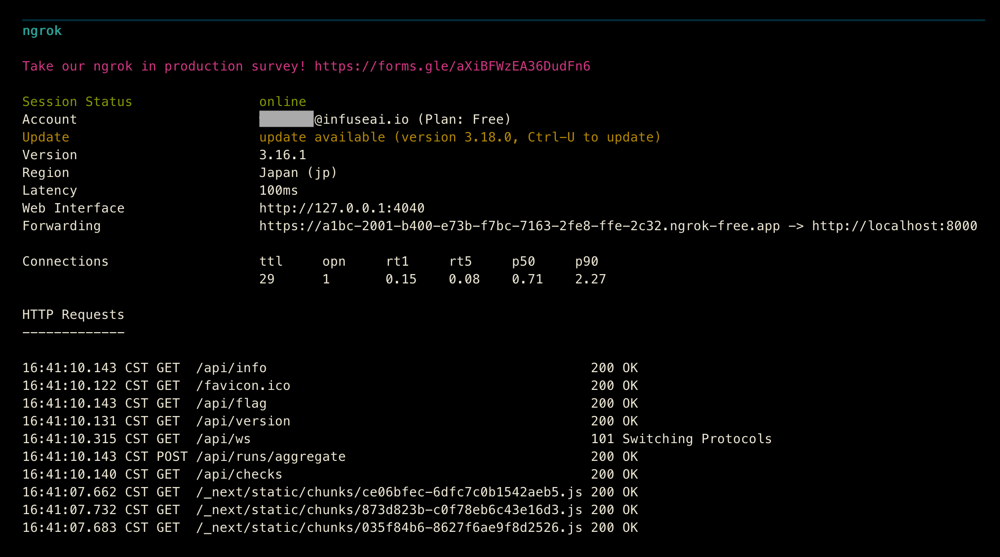

!!! Note

    Recce Cloud is currently in **private alpha** and scheduled for general availability later this year.  [Sign up](../../cloud.md#signup) to the Recce newsletter to be notified, or email [product@datarecce.io](mailto:product@datarecce.io) to join our design partnership program for early access.

As a Recce Cloud user, you can launch a Recce Instance in [Cloud Mode](index.md#launch-the-recce-server-in-the-cloud-mode) or use [GitHub Codespaces](setup-gh-codespaces.md). However, both of these methods require a GitHub Access Token, which restricts the usage of Recce to those with GitHub accounts.

For situations in which you would like to share your Recce Instance with non-GitHub users, such as stakeholders or other teams, we currently recommend the use of one of the following third-party utilities:

- [Ngrok](https://ngrok.com/) 
- [Tailscale](https://tailscale.com/)

These services provide an endpoint for your Recce Instance, with optional authentication, that will enable other users to access Recce.

*These approaches serve as a workaround to expose a Recce instance to non-GitHub users. We are currently working on official support for enabling this feature without the need for third-party tools.*


## Provide external access to a Recce Instance

!!! Note

    Using these tools requires registering additional accounts, and you may need to subscribe to a paid plan to accommodate your usage and data transfer volume. For details, please refer to the Pricing Plans of [ngrok](https://ngrok.com/pricing) and [tailscale](https://tailscale.com/pricing).

### Ngrok

After installing the Ngrok client, you can create an endpoint for the Recce Instance that will allow other users to participate in the dbt PR review process, without any additional tools or setup.

1. Setup the ngrok agent
   
   ngrok supports multiple platforms, including macOS, Linux, and Windows. Please refer to the [official installation guide](https://ngrok.com/docs/getting-started/) for details.

1. Connect your ngrok agent to your ngrok account.
    ```shell
    ngrok config add-authtoken <TOKEN>
    ```

1. Put the Recce Instance online
    ```shell
    ngrok http <recce-instance-port>
    ```

    {: .shadow}

1. Secure access with authentication

    ngrok provides a range of authentication options, from basic methods to integration with multiple OAuth providers.
    ```shell
    # basic auth
    ngrok http <recce-instance-port> --basic-auth 'username:password'

    # OAuth
    ngrok http <recce-instance-port> --oauth=google --oauth-allow-email=user@example.com
    ```

    For the full usage of settings and options, please refer to the [ngrok http docs](https://ngrok.com/docs/http/) for details.


### Tailscale

Through tailscale, you can create your own private network (called a tailnet) and invite members to join it. Once set up, you can easily expose your Recce instance, making it accessible to all devices within the tailnet.

1. Setup tailscale
    
    To create tailnet, users need to create an account and download tailscale. Please follow the [official guide](https://tailscale.com/kb/1017/install) to set it up.
    Then you can invite other members to join.

    {: .shadow}

    It also supports [integration with GitHub Codespaces](https://tailscale.com/kb/1160/github-codespaces).

1. Connect your device to your account
    ```shell
    tailscale up --authkey <AUTH_KEY>
    ```

1. Put the Recce Instance online

    The devices within your tailnet can access the Recce instance now.

    ```shell
    tailscale serve <recce-instance-port>
    ```

    {: .shadow}

    If you need more fine-grained access control policy, please refer [tailscale docs](https://tailscale.com/kb/1350/manage).
