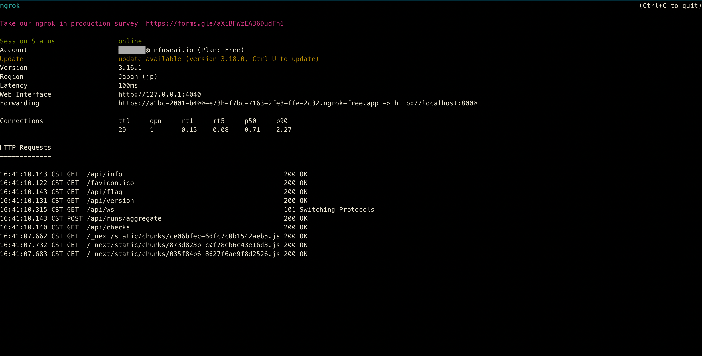
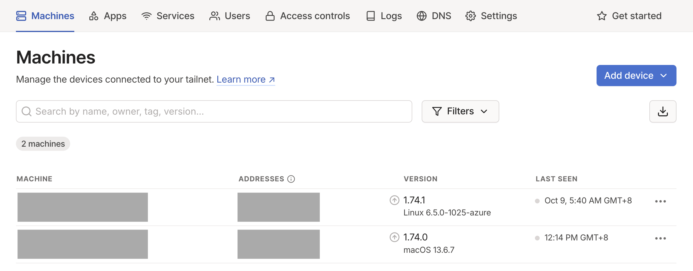
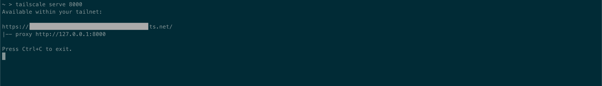

!!! Note

    Recce Cloud is currently in **private alpha** and scheduled for general availability later this year.  [Sign up](../../cloud.md#signup) to the Recce newsletter to be notified, or email [product@datarecce.io](mailto:product@datarecce.io) to join our design partnership program for early access.

After joining Recce Cloud, you can use a Recce instance either by [launching it in cloud mode](index.md#launch-the-recce-server-in-the-cloud-mode) or by [using it in a GitHub Codespace](setup-gh-codespaces.md). Both methods require your GitHub token. However, if you like Recce and want to share your Pull Request's (PR's) Recce instance with other members in your organization for collaboration. How can you involve business-side stakeholders who may not have GitHub accounts?

## Expose Recce instance
Below, we will introduce two convenient tools, [ngrok](https://ngrok.com/) and [tailscale](https://tailscale.com/). They can create an endpoint for your Recce instance, allowing others to connect to it. Each of these tools also has its own authentication method, which enables you to manage who can access your Recce instance.

These approaches serve as a workaround to expose the Recce instance to non-GitHub users. Stay tuned with Recce for more updates on non-GitHub user support.

!!! Note

    Using these tools requires registering additional accounts, and you may need to subscribe to a paid plan to accommodate your usage and data transfer volume. For details, please refer to the Pricing Plans of [ngrok](https://ngrok.com/pricing) and [tailscale](https://tailscale.com/pricing).

### ngrok
By installing the ngrok CLI agent, you can create an ngrok endpoint and point it to the Recce instance. This allows other team members, without requiring any additional setup on their part, to participate in the Recce review workflow of the data project.

1. Setup ngrok agent
   
   ngrok supports multiple platforms, including macOS, Linux, and Windows. Please refer to the [official installation guide](https://ngrok.com/docs/getting-started/) for details.

1. Connect your ngrok agent to your ngrok account.
    ```shell
    ngrok config add-authtoken <TOKEN>
    ```

1. Put the Recce Instance online
    ```shell
    ngrok http <recce-instance-port>
    ```

    {: .shadow}

1. Secure access with authentication

    ngrok provides a range of authentication options, from basic methods to integration with multiple OAuth providers.
    ```shell
    # basic auth
    ngrok http <recce-instance-port> --basic-auth 'username:password'

    # OAuth
    ngrok http <recce-instance-port> --oauth=google --oauth-allow-email=user@example.com
    ```

    For the full usage of settings and options, please refer to the [ngrok http docs](https://ngrok.com/docs/http/) for details.


### tailscale

Through tailscale, you can create your own private network (called a tailnet) and invite members to join it. Once set up, you can easily expose your Recce instance, making it accessible to all devices within the tailnet.

1. Setup tailscale
    
    To create tailnet, users need to create an account and download tailscale. Please follow the [official guide](https://tailscale.com/kb/1017/install) to set it up.
    Then you can invite other members to join.

    {: .shadow}

    It also supports [integration with GitHub Codespaces](https://tailscale.com/kb/1160/github-codespaces).

1. Connect your device to your account
    ```shell
    tailscale up --authkey <AUTH_KEY>
    ```

1. Put the Recce Instance online

    The devices within your tailnet can access the Recce instance now.

    ```shell
    tailscale serve <recce-instance-port>
    ```

    {: .shadow}

    If you need more fine-grained access control policy, please refer [tailscale docs](https://tailscale.com/kb/1350/manage).
