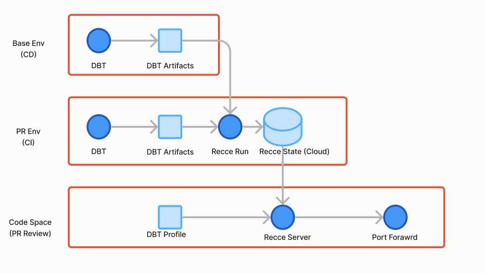

Recce Cloud is a service specifically designed for DBT PR Review workflow. This document briefly introduces how to integrate Recce Cloud with a GitHub repository.

Without Recce Cloud, we use the Recce State File to store PR review states. However, this method is not very suitable for collaboration or integration with CI because our review states are not stored in a fixed location. Recce Cloud is designed to solve this problem.


## Prerequisite

1. Prepare the github personal access token. Please see the [GitHub document](https://docs.github.com/en/authentication/keeping-your-account-and-data-secure/managing-your-personal-access-tokens). And set it to your environment variable.
   ```
   export GITHUB_TOKEN=<token>
   ```

1. Prepare the Recce state password. The Recce state password is used to encrypt/decrypt the state file before uploading/downloading it to/from Recce Cloud. The password is not stored in Recce Cloud, so you need to keep it safe.
   ```
   export RECCE_STATE_PASSWORD=<password>
   ```
   Or you can set it by the Recce's command line option with `--password <password>` or `-p <password>`

1. (Optional) Install the github cli. Please see the [GitHub CLI document](https://github.com/cli/cli)


## Integrate with the PR review workflow
### Launch the `recce server` in the cloud mode

1. Create a branch for developing.
   ```
   git checkout -b <my-awesome-feature>
   ```
1. Develop your features and prepare the dbt artifacts for the base (`target-base/`) and current (`target/`) environments.
1. Create a pull request for this branch
   ```
   gh pr create
   ```   
1. Launch the recce server in the cloud mode. It will use the dbt artifacts in the local `target` and `target-base` and initiate a new review state if necessary.
   ```
   recce server --cloud
   ```

### Execute the `recce run` in the cloud mode


In general, recce run is used in CI/CD or automation environments. We can use recce run to generate the review state and perform checks. Since it is an automated environment, we assume that the pull request already exists and that the automated process triggers recce run.

1. Checkout a branch
   ```
   gh pr checkout 
   ```
1. Prepare dbt artifacts for the base (`target-base/`) and current (`target/`) environments.
1. Execute the recce run in the cloud mode. It will use the dbt artifacts in the local `target` and `target-base` and initiate a new review state if necessary.
   ```
   recce run --cloud
   ```

### Review in the `recce server` in the cloud mode
If the review state is already available for this PR, you can open the recce server to review.

1. Checkout the branch for a PR.
    ```
    gh pr checkout <pr number>
    ```

1. Launch the recce server to review this PR
    ```
    recce server --review --cloud
    ```

## Integrate the CI/CD workflow

[Continuous Integration(CI)](https://en.wikipedia.org/wiki/Continuous_integration) and [Continuous Delivery(CD)](https://en.wikipedia.org/wiki/Continuous_delivery) are best practices in software development. Through CI automation, a dbt project can systematically and continuously deliver and integrate high-quality results.

To automate the process, we can use [GitHub Actions](https://github.com/features/actions) and [GitHub Codespaces](https://github.com/features/codespaces) to provide an automated and reusable workspace. The following diagram describes the entire ci/cd architecture.

{: .shadow}

Next, we will guide you through the process of integrating Recce Cloud with your GitHub repository in three steps.

1. **Setup CD in GitHub Actions**: Periodic generation of a base environment for use as a comparison base for recce.
1. **Setup CI in GitHub Actions**: When pushing to the PR branch, automatically generate a PR environment. Then execute a recce run and place the results in the recce cloud.
1. **Setup GitHub Codespaces**: Define a Codespace configuration that can generate a corresponding recce codespace instance in GitHub PR for PR review.