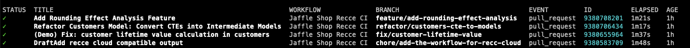

In this step, we will set up the automated preparation of the PR environment and upload the dbt artifacts to GitHub workflow artifacts. We will also retrieve the artifacts of the base environment to run recce, and place the state file in the artifacts so that the recce server can be launched in Codespaces for PR review.

## Workflow Template

````yaml
name: Recce CI PR Branch

on:
  pull_request:
    branches: [main]

jobs:
  check-pull-request:
    name: Check pull request by Recce CI
    runs-on: ubuntu-latest
    steps:
      - name: Checkout repository
        uses: actions/checkout@v3
        with:
          fetch-depth: 0
      - name: Set up Python
        uses: actions/setup-python@v4
        with:
          python-version: "3.10.x"
      - name: Install dependencies
        run: |
          pip install -r requirements.txt
          pip install recce
      - name: Prepare dbt Base environment
        run: |
          gh repo set-default ${{ github.repository }}
          base_branch=${{ github.base_ref }}
          run_id=$(gh run list --workflow ${WORKFLOW_BASE} --branch ${base_branch} --status success --limit 1 --json databaseId --jq '.[0].databaseId')
          echo "Download artifacts from run $run_id"
          gh run download ${run_id} -n target -D target-base
        env:
          GH_TOKEN: ${{ secrets.GITHUB_TOKEN }}
          WORKFLOW_BASE: ".github/workflows/dbt_base.yml"
      - name: Prepare dbt Current environment
        run: |
          git checkout ${{ github.event.pull_request.head.sha }}
          dbt deps
          dbt seed --target ${{ env.DBT_CURRENT_TARGET}}
          dbt run --target ${{ env.DBT_CURRENT_TARGET}}
          dbt docs generate --target ${{ env.DBT_CURRENT_TARGET}}
        env:
          DBT_CURRENT_TARGET: "dev"

      - name: Run Recce CI
        run: |
          recce run --github-pull-request-url ${{ github.event.pull_request.html_url }}

      - name: Upload DBT Artifacts
        uses: actions/upload-artifact@v4
        with:
          name: target
          path: target/

      - name: Upload Recce State File
        uses: actions/upload-artifact@v4
        id: recce-artifact-uploader
        with:
          name: recce-state-file
          path: recce_state.json

      - name: Prepare Recce Summary
        id: recce-summary
        run: |
          recce summary recce_state.json > recce_summary.md
          cat recce_summary.md >> $GITHUB_STEP_SUMMARY
          echo '${{ env.NEXT_STEP_MESSAGE }}' >> recce_summary.md

          # Handle the case when the recce summary is too long to be displayed in the GitHub PR comment
          if [[ `wc -c recce_summary.md | awk '{print $1}'` -ge '65535' ]]; then
            echo '# Recce Summary
          The recce summary is too long to be displayed in the GitHub PR comment.
          Please check the summary detail in the [Job Summary](${{github.server_url}}/${{github.repository}}/actions/runs/${{github.run_id}}) page.
          ${{ env.NEXT_STEP_MESSAGE }}' > recce_summary.md
          fi

        env:
          ARTIFACT_URL: ${{ steps.recce-artifact-uploader.outputs.artifact-url }}
          NEXT_STEP_MESSAGE: |
            ## Next Steps
            If you want to check more detail information about the recce result, please download the [artifact](${{ steps.recce-artifact-uploader.outputs.artifact-url }}) file and open it by [Recce](https://pypi.org/project/recce/) CLI.

            ### How to check the recce result
            ```bash
            # Unzip the downloaded artifact file
            tar -xf recce-state-file.zip

            # Launch the recce server based on the state file
            recce server --review recce_state.json

            # Open the recce server http://localhost:8000 by your browser
            ```

      - name: Comment on pull request
        uses: thollander/actions-comment-pull-request@v2
        with:
          filePath: recce_summary.md
          comment_tag: recce
````

## How to Check

1. List the latest run for the workflow
   ```
   gh run list --workflow .github/workflows/recce_ci.yml    
   ```
   

1. Download and check the artifact with name `target`
   ```
   mkdir /tmp/recce_ci
   gh run download 9380708201 -n recce-state-file -D /tmp/recce_ci
   gh run download 9380708201 -n target -D /tmp/recce_ci/target
   ```
1. Check the folder
    ```
    tree -L 2 /tmp/recce_ci
    ```
    result    
    ``` 
    /tmp/recce_ci
    ├── recce_state.json
    └── target
        ├── catalog.json
        ├── compiled
        ├── graph.gpickle
        ├── index.html
        ├── manifest.json
        ├── partial_parse.msgpack
        ├── run
        └── run_results.json

    3 directories, 7 files
    ```


