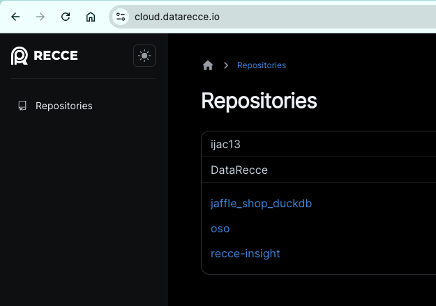
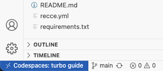
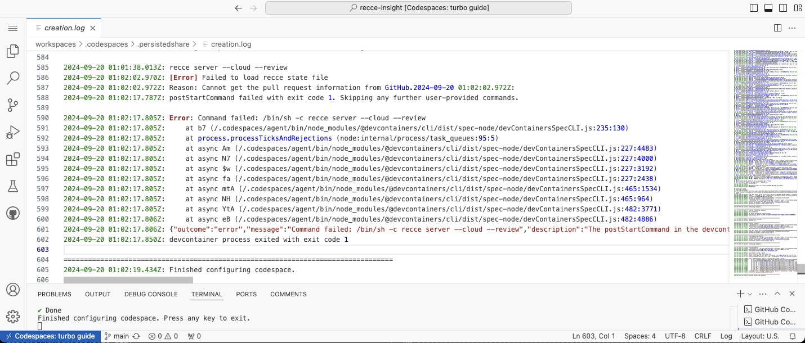
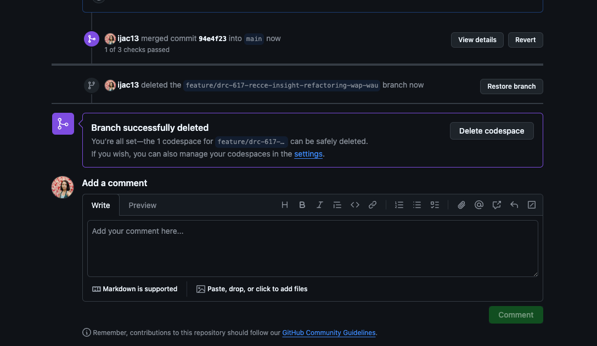

!!! Note

    Recce Cloud is currently in **private alpha** and scheduled for general availability later this year.  [Sign up](../../cloud.md#signup) to the Recce newsletter to be notified, or email [product@datarecce.io](mailto:product@datarecce.io) to join our design partnership program for early access.

GitHub Codespaces is a development environment provided by GitHub that allows developers to have identical and isolated environments for development. The GitHub Codespaces uses VS Code Server technology. We can launch it from a GitHub pull request page, and once it is started, the Recce instance will run and port forwarding will be set up. 

## Setup Recce Cloud in GitHub Codespaces

1. Prepare the two files in your repository
    ```
    .devcontainer
    └── recce
        ├── Dockerfile
        └── devcontainer.json
    ```

    !!! Tip 

        You can place the devcontainer configuration in [any valid location for Codespaces](https://docs.github.com/en/codespaces/setting-up-your-project-for-codespaces/adding-a-dev-container-configuration/introduction-to-dev-containers#creating-a-custom-dev-container-configuration). However, Recce Cloud will prioritize using `.devcontainer/recce/devcontainer.json` if it is available.

1. Configure the `.devcontainer/recce/devcontainer.json`
    ```json
    {
        "name": "Recce CodeSpace",
        "build": {
            "dockerfile": "Dockerfile",
        },
        "containerEnv": {
            "RECCE_STATE_PASSWORD": "${{ secrets.RECCE_STATE_PASSWORD }}",
            "DBT_USER": "${{ secrets.DBT_USER }}",
            "DBT_PASSWORD": "${{ secrets.DBT_PASSWORD }}",
        },
        "forwardPorts": [8000],
        "postStartCommand": "recce server --cloud --review"
    }
    ```
    The secrets are Github Codespaces secrets. You can configure them in
    - [Account specific codespaces secrets](https://docs.github.com/en/codespaces/managing-your-codespaces/managing-your-account-specific-secrets-for-github-codespaces) 
    - or [Repository-level or organization-level codespaces secrets](https://docs.github.com/en/codespaces/managing-codespaces-for-your-organization/managing-development-environment-secrets-for-your-repository-or-organization)

1. Prepare the `.devcontainer/Dockerfile`
    ```
    FROM mcr.microsoft.com/vscode/devcontainers/python:3.11

    RUN pip install dbt-bigquery~=1.7.0 recce~=0.34
    ```
!!!Note

    The GitHub token [generated by codespace](https://docs.github.com/en/codespaces/developing-in-a-codespace/default-environment-variables-for-your-codespace) is sufficient for Recce's use. It's not necessary to configure the `GITHUB_TOKEN` separately.

## How to use
Once you complete [Recce Cloud setup](index.md/#sign-up-the-recce-cloud), you can launch GitHub Codespaces from Recce Cloud's pull request page, and once it is started, the Recce instance will run and port forwarding will be set up.
 
1. Go to Recce Cloud and click the repository you want to make changes. 
    {: .shadow}
2. Click the pull request that you want to use Recce instance.  
    {: .shadow}
3. Click "Create in GitHub Codespaces."
    {: .shadow}
4. The Codespaces creation may take 1 to more than 5 mintues depeding on your Codespaces settings. And the Recce instance should take less than 1 minute to launch. 
    - Please view [FAQ](#faq) for how to speed up.
5. You can see the "State" of the progress; And the Action you can take in each state.
    - Codespace Queued: the Codespace is creating 
        {: .shadow}
    - Codespace Provisioning: the Codespace is provisioning
    - Codespace Available: the Codespace is ready
    - Recce launching: Recce instance is launching
      - Stop: stop launching Recce instance
    - Recce active: Recce instance is launched successfully. 
        - Open: open the Recce instance
        - Stop: stop the Codespace
        {: .shadow}
    - Codespace ShuttingDown: the Codespace is shutting down
    - Stopped: the Codespace is stopped and the Recce instance is closed.
        - Restart: restart the Codespace 
        - Delete: delete the Codespace
            - It’s recommended to delete the Codespace once your PR is merged. 

  
## Troubleshooting

If this is your first time setting up a Codespace, it’s recommended to first [test locally](./getting-started-recce-cloud.md#review-the-pr) with the following commands:

```shell
git checkout feature/recce-getting-started
export GITHUB_TOKEN=<github-token>
export RECCE_STATE_PASSWORD=mypassword
recce server --cloud --review
```

Ensure it runs correctly locally. If it does, then the remaining issues within the Codespace are likely related to its configuration.

If your Codespace configration is correct, other common causes might include:

1. The current branch does not have a corresponding pull request. This usually happens if you launch Codespace directly form GitHub main branch. Recce instance cannot assoicate with the main branch. 
2. The pull request does not have an uploaded [Recce state file](../features/state-file.md). In review mode, the state file must be prepared via CI or locally before proceeding.
3. The `RECCE_STATE_PASSWORD` mentioned above is not set or the password is incorrect.
4. Other issues are preventing the Recce server from starting at all.

When you’ve opened a Codespace but are unable to connect to the Recce instance, you can troubleshoot by following these steps:

1. Check Codespace instance in GitHub. 
    {: .shadow}
2. If the Codesapce you created from Recce Cloud is active, click "Open in Browser". 
    {: .shadow}
3. Click on the blue block in the lower left corner of the status bar, which usually shows "Codespaces: instance name"   
    
4. Select "View creation log" or ppen the VS Code Command Palette and type `Codespaces: View Creation Log`. 
5. At this point, you should be able to see the reason why the Recce server failed to start.   
    
6. If you cannot find any issue from the Codespace creation log, and belive your Codespace configration is correct. Please stop the Codespace and launch Recce instance again. 
7. If you still have problem, please contact us via [slack](https://getdbt.slack.com/archives/C05C28V7CPP) or email [product@datarecce.io](mailto:product@datarecce.io). We are happy to help.


## FAQ

**Q: How long does Codespace generally take to start?**

The typical startup time is around 1 to 2 minutes if you have prebuid. If not, it may take more than 5 mintues. However, this depends on how your Dockerfile is configured. Codespace builds your image every time it starts, so if your Dockerfile includes multiple pip install <packages>, it may take longer.

Once your Codespace instance is already running, you won’t need to wait again when you return to it.

**Q: Is there a way to optimize the startup speed?**

Codespace offers a [prebuild](https://docs.github.com/en/codespaces/prebuilding-your-codespaces) feature, which can significantly improve startup speed. In our sample project, we found it's helpful to reduce prebuild when we set prebuild available to only sepecific regions. However, you need to ensure that the image is up-to-date. To strike a balance between speed and update frequency, you can consider scheduling a weekly image rebuild.


**Q: Can a Codespace environment be shared? Can different people access the same Codespace instance?**

A Codespace environment is tied to each individual GitHub user account. Therefore, a Codespace instance opened by User A cannot be directly accessed by User B. However, User A can set a specific port to be public and [share the URL with others](https://docs.github.com/en/codespaces/developing-in-a-codespace/forwarding-ports-in-your-codespace#sharing-a-port). However, the instance is still running under User A's account.

**Q: Personal Codespace vs. Organization Codespace? How is Codespace billed?**

By default, Codespace usage is billed to a GitHub personal account. GitHub offers a free tier, allowing each user 120 core hours per month for free.

For GitHub organization accounts, you can configure all Codespace charges to be billed to the organization. In this case, billing is attributed to the organization rather than personal accounts.

For more details on billing, please refer to the official [CodeSpace billing documentation](https://docs.github.com/en/billing/managing-billing-for-github-codespaces/about-billing-for-github-codespaces).


**Q: How to configure codespaces?**

Codespace utilizes VSCode Dev Containers technology, which can be executed either locally (via Docker) or in the cloud (via GitHub Codespace). The configuration above provided are primarily recommendations for the Recce Cloud setup. For more advanced configuration options, you can refer to the [VSCode dev containers](https://code.visualstudio.com/docs/devcontainers/containers) or the [containers.dev](https://containers.dev/) documentation.

The default configuration for GitHub Codespace is explained in the [documentation](https://docs.github.com/en/codespaces/setting-up-your-project-for-codespaces/adding-a-dev-container-configuration/introduction-to-dev-containers). If you're looking to set up a development environment for dbt/Recce, you can also refer to the [Python project configuration documentation](https://docs.github.com/en/codespaces/setting-up-your-project-for-codespaces/adding-a-dev-container-configuration/setting-up-your-python-project-for-codespaces).

**Q: Can I have multiple devcontainer configurations? Which one is selected by default?**

Yes, you can. Please refer to the [Codespaces documentation](https://docs.github.com/en/codespaces/setting-up-your-project-for-codespaces/adding-a-dev-container-configuration/introduction-to-dev-containers#creating-a-custom-dev-container-configuration) for more details. Recce Cloud will prioritize `.devcontainer/recce/devcontainer.json` if it is available. If not, it will default to `.devcontainer/devcontainer.json`, and then any other available configurations.

**Q: Should I delete Codespace after PR merged?**

Yes. When you merged a PR, you'll see the Delete codespace message. You can delete the Codespace to save the free usage. 
{: .shadow}

You can also delete Codespace in your GitHub main branch or in Recce Cloud PR page. 
{: .shadow}