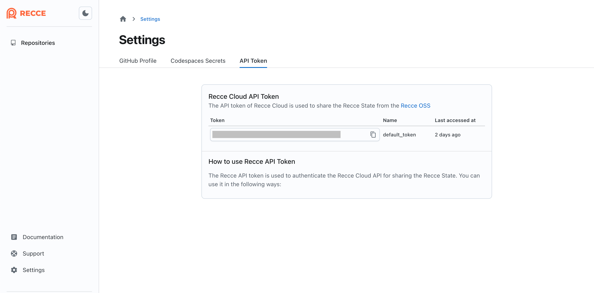
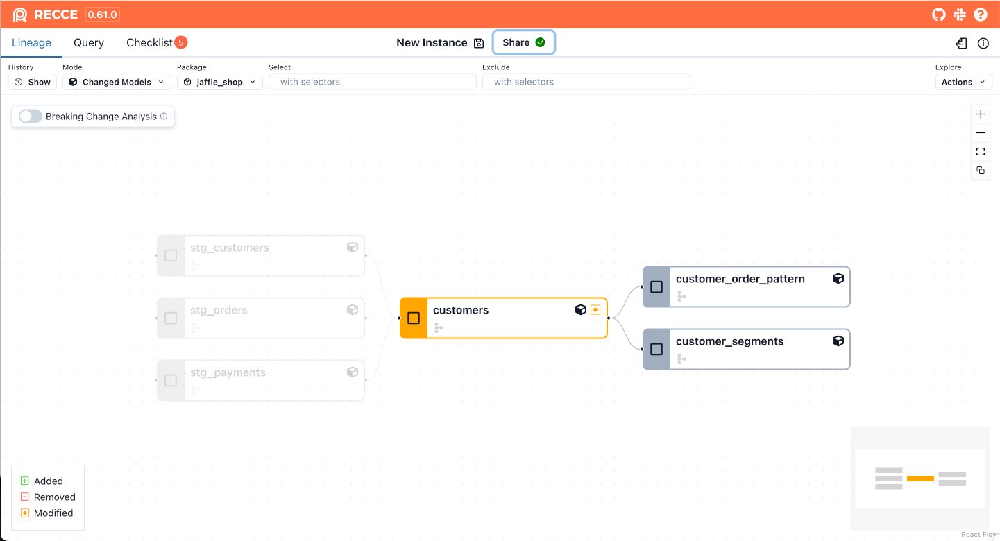
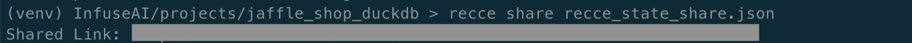

If you've already used Recce to validate your PR and prepared checks, but stakeholders might not have the environment to run Recce. Recce Cloud allows you to quickly and easily share your Recce validation results. Just click your share link to open a read-only Recce instance directly in the browser with __no local setup required__, so your reviewers or stakeholders can quickly join the review process.

!!! Note

    Please note that Recce users with the link can visit your sharing session.

## How to use

1. Obtain API token from Recce Cloud
    
    To connect to your Recce Cloud account, you need an API token. Please copy your API Token from the [personal settings page](https://cloud.datarecce.io/settings#tokens) in Recce Cloud.
    {: .shadow}

1. Add the token to `.recce/profile.yml`

    For convenience, you can enter your API token in `.recce/profile.yml`, located by default in your home directory. 
    ```yaml
    user_id: <your_user_id>
    api_token: <your_api_token>
    ```
    Or, you can use `--api-token` flag with commend for one-time use. e.g.,
    ```bash
    recce server --api-token <your_api_token>
    ```

1. Start Recce server

    After launching, you'll see the __Share__ button at the top, then you can click it to get the link.
    {: .shadow}

    You can also use the `recce share` command. If you already have a prepared Recce state file, you can obtain a share link directly through the command line.
    ```bash
    recce share <your_state_file>
    recce share --api-token <your_api_token> <your_state_file>  # for one-time use
    ```
    {: .shadow}
