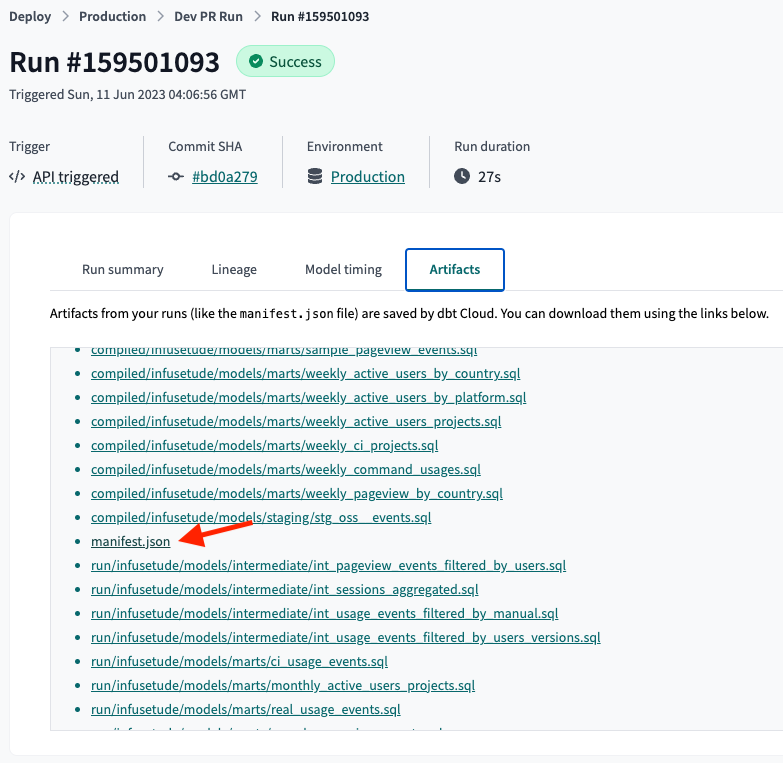

# Start with dbt Cloud

dbt Cloud is a hosted service that provides a managed environment for running dbt projects by [dbt Labs](https://docs.getdbt.com/docs/cloud/about-cloud/dbt-cloud-features). This document provides a step-by-step guide to get started `recce` with dbt Cloud.

## Prerequisites

`Recce` will compare the data models between two environments. That means you need to have two environments in your dbt Cloud project. For example, one for production and another for development.
Also, you need to provide the credentials profile for both environments in your `profiles.yml` file to let `Recce` access your data warehouse.

### Suggestions for setting up dbt Cloud

To integrate the dbt Cloud with Recce, we suggest to set up two run jobs in your dbt Cloud project.

#### Production Run Job

The production run should be the main branch of your dbt project. You can trigger the dbt Cloud job on every merge to the main branch or schedule it to run at a daily specific time.

#### Development Run Job

The development run should be a separate branch of your dbt project. You can trigger the dbt Cloud job on every merge to the pull-request branch.

### Set up dbt profiles with credentials

You need to provide the credentials profile for both environments in your `profiles.yml` file. Here is an example of how your `profiles.yml` file might look like:

```yaml
dbt-example-project:
  target: dev
  outputs:
    dev:
      type: snowflake
      account: "{{ env_var('SNOWFLAKE_ACCOUNT') }}"

      # User/password auth
      user: "{{ env_var('SNOWFLAKE_USER') | as_text }}"
      password: "{{ env_var('SNOWFLAKE_PASSWORD') | as_text }}"

      role: DEVELOPER
      database: cloud_database
      warehouse: LOAD_WH
      schema: "{{ env_var('SNOWFLAKE_SCHEMA') | as_text }}"
      threads: 4
    prod:
      type: snowflake
      account: "{{ env_var('SNOWFLAKE_ACCOUNT') }}"

      # User/password auth
      user: "{{ env_var('SNOWFLAKE_USER') | as_text }}"
      password: "{{ env_var('SNOWFLAKE_PASSWORD') | as_text }}"

      role: DEVELOPER
      database: cloud_database
      warehouse: LOAD_WH
      schema: PUBLIC
      threads: 4
```

## Install `Recce`

Install Recce using `pip`:

```shell
pip install -U recce
```

## Execute Recce with dbt Cloud

To compare the data models between two environments, you need to download the dbt Cloud artifacts for both environments. The artifacts include the manifest.json file and the catalog.json file. You can download the artifacts from the dbt Cloud UI.

### Login to your dbt Cloud account


### Go to the project you want to compare


### Download the dbt artifacts

Download the artifacts from the latest run of both run jobs. You can download the artifacts from the `Artifacts` tab.




### Setup the dbt artifacts folders

Extract the downloaded artifacts and keep them in a separate folder. The production artifacts should be in the `target-base` folder and the development artifacts should be in the `target` folder.

```bash
$ tree target target-base
target
├── catalog.json
└── manifest.json
target-base/
├── catalog.json
└── manifest.json
```

### Setup dbt project

Move the `target` and `target-base` folders to the root of your dbt project.
You should also have the `profiles.yml` file in the root of your dbt project with the credentials profile for both environments.

### Start the `Recce` server

Run the `recce` command to compare the data models between the two environments.

```shell
recce server
```
